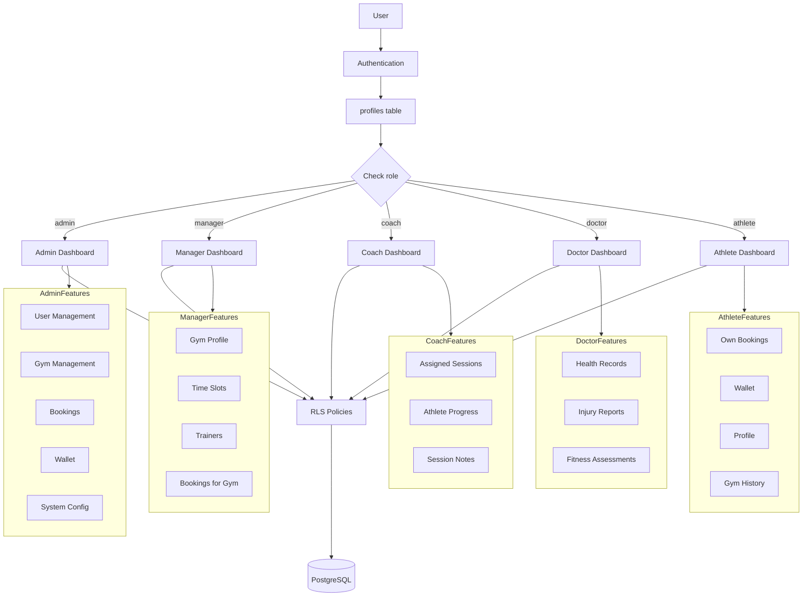
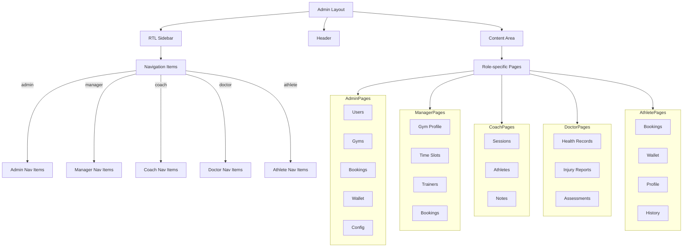

# Admin Panel with RBAC — Implementation Plan

## Executive Summary

This plan outlines the implementation of a unified admin panel for rokhdad FIT with role-based access control (RBAC). The admin panel will serve all user roles (athlete, manager, coach, doctor, admin) with role-specific interfaces, Persian language support, and RTL layout. All authorization will be enforced through Supabase Row Level Security (RLS) policies.

---

## 1. Overview & Architecture

### 1.1 Purpose and Scope

The admin panel provides a centralized interface for managing the rokhdad FIT platform across all user roles. Each role sees a tailored interface based on their permissions and responsibilities.

**Core Principles:**
- Single unified `/admin` route for all roles
- Role-based UI rendering based on user's `profiles.role`
- Supabase RLS policies as the sole authorization mechanism
- Persian language only (RTL layout)
- Phase 1 focuses on CRUD operations only (no analytics)

### 1.2 RBAC Architecture



### 1.3 Role Hierarchy and Permissions Matrix

| Role | User Mgmt | Gym Mgmt | Bookings | Wallet | System Config | Time Slots | Trainers | Sessions | Health Records |
|------|-----------|----------|----------|--------|---------------|------------|----------|----------|----------------|
| **Admin** | ✅ All | ✅ All | ✅ All | ✅ All | ✅ All | ✅ All | ✅ All | ✅ All | ✅ All |
| **Manager** | ❌ | ✅ Own | ✅ Own Gym | ❌ | ❌ | ✅ Own Gym | ✅ Own Gym | ✅ Own Gym | ❌ |
| **Coach** | ❌ | ❌ | ✅ Assigned | ❌ | ❌ | ❌ | ❌ | ✅ Assigned | ❌ |
| **Doctor** | ❌ | ❌ | ❌ | ❌ | ❌ | ❌ | ❌ | ❌ | ✅ All |
| **Athlete** | ❌ | ❌ | ✅ Own | ✅ Own | ❌ | ❌ | ❌ | ❌ | ✅ Own |

**Legend:**
- ✅ All: Full read/write access to all records
- ✅ Own: Read/write access only to own records or records linked to user
- ✅ Own Gym: Read/write access only to records for gyms managed by user
- ✅ Assigned: Read/write access only to records assigned to user
- ❌: No access

---

## 2. Database Schema & RLS Policies

### 2.1 Current Schema Overview

**Existing Tables:**
- `profiles`: User profiles with role field
- `athlete_profiles`: Extended athlete information
- `gyms`: Gym information with manager_id
- `gym_trainers`: Trainers linked to gyms (coaches)
- `gym_time_slots`: Time slots for bookings
- `bookings`: Booking records
- `wallet_transactions`: Wallet transaction history
- `gym_reviews`, `gym_photos`, `gym_amenities`, `gym_sport_types`: Gym-related data

**New Tables Needed:**
- `coach_assignments`: Link coaches to bookings/sessions
- `health_records`: Doctor-managed health records
- `injury_reports`: Doctor-managed injury reports
- `fitness_assessments`: Doctor-managed fitness assessments

### 2.2 RLS Policy Strategy

All authorization will be handled through Supabase RLS policies. The pattern:

```sql
-- Generic policy pattern
CREATE POLICY "Policy Name"
    ON table_name FOR operation
    USING (role_check_expression)
    WITH CHECK (role_check_expression);
```

**Role Check Helper Function:**
```sql
CREATE OR REPLACE FUNCTION public.get_user_role()
RETURNS TEXT AS $$
    SELECT role FROM public.profiles WHERE id = auth.uid();
$$ LANGUAGE sql SECURITY DEFINER;
```

### 2.3 RLS Policies by Table and Role

#### 2.3.1 profiles Table

**Admin:** Full access
```sql
CREATE POLICY "Admins can read all profiles"
    ON public.profiles FOR SELECT
    USING (EXISTS (
        SELECT 1 FROM public.profiles 
        WHERE id = auth.uid() AND role = 'admin'
    ));

CREATE POLICY "Admins can update all profiles"
    ON public.profiles FOR UPDATE
    USING (EXISTS (
        SELECT 1 FROM public.profiles 
        WHERE id = auth.uid() AND role = 'admin'
    ))
    WITH CHECK (EXISTS (
        SELECT 1 FROM public.profiles 
        WHERE id = auth.uid() AND role = 'admin'
    ));
```

**All Roles:** Read own profile
```sql
CREATE POLICY "Users can read own profile"
    ON public.profiles FOR SELECT
    USING (id = auth.uid());

CREATE POLICY "Users can update own profile"
    ON public.profiles FOR UPDATE
    USING (id = auth.uid())
    WITH CHECK (id = auth.uid());
```

#### 2.3.2 gyms Table

**Admin:** Full access
```sql
CREATE POLICY "Admins can manage all gyms"
    ON public.gyms FOR ALL
    USING (EXISTS (
        SELECT 1 FROM public.profiles 
        WHERE id = auth.uid() AND role = 'admin'
    ));
```

**Manager:** Read/write own gyms
```sql
CREATE POLICY "Managers can read own gyms"
    ON public.gyms FOR SELECT
    USING (manager_id = auth.uid());

CREATE POLICY "Managers can update own gyms"
    ON public.gyms FOR UPDATE
    USING (manager_id = auth.uid())
    WITH CHECK (manager_id = auth.uid());
```

**All Roles:** Read active gyms (public access)
```sql
CREATE POLICY "Active gyms are publicly readable"
    ON public.gyms FOR SELECT
    USING (is_active = true);
```

#### 2.3.3 bookings Table

**Admin:** Full access
```sql
CREATE POLICY "Admins can manage all bookings"
    ON public.bookings FOR ALL
    USING (EXISTS (
        SELECT 1 FROM public.profiles 
        WHERE id = auth.uid() AND role = 'admin'
    ));
```

**Manager:** Read bookings for own gyms
```sql
CREATE POLICY "Managers can read bookings for own gyms"
    ON public.bookings FOR SELECT
    USING (EXISTS (
        SELECT 1 FROM public.gyms
        WHERE gyms.id = bookings.gym_id
        AND gyms.manager_id = auth.uid()
    ));
```

**Coach:** Read bookings for assigned sessions
```sql
CREATE POLICY "Coaches can read assigned bookings"
    ON public.bookings FOR SELECT
    USING (EXISTS (
        SELECT 1 FROM public.coach_assignments
        WHERE coach_assignments.booking_id = bookings.id
        AND coach_assignments.coach_id = auth.uid()
    ));
```

**Athlete:** Read/write own bookings
```sql
CREATE POLICY "Athletes can read own bookings"
    ON public.bookings FOR SELECT
    USING (athlete_id = auth.uid());

CREATE POLICY "Athletes can create own bookings"
    ON public.bookings FOR INSERT
    WITH CHECK (athlete_id = auth.uid());

CREATE POLICY "Athletes can update own bookings"
    ON public.bookings FOR UPDATE
    USING (athlete_id = auth.uid())
    WITH CHECK (athlete_id = auth.uid());
```

#### 2.3.4 wallet_transactions Table

**Admin:** Full access
```sql
CREATE POLICY "Admins can manage all wallet transactions"
    ON public.wallet_transactions FOR ALL
    USING (EXISTS (
        SELECT 1 FROM public.profiles 
        WHERE id = auth.uid() AND role = 'admin'
    ));
```

**Athlete:** Read own transactions
```sql
CREATE POLICY "Athletes can read own wallet transactions"
    ON public.wallet_transactions FOR SELECT
    USING (profile_id = auth.uid());
```

#### 2.3.5 gym_trainers Table (Coach Access)

**Admin:** Full access
```sql
CREATE POLICY "Admins can manage all trainers"
    ON public.gym_trainers FOR ALL
    USING (EXISTS (
        SELECT 1 FROM public.profiles 
        WHERE id = auth.uid() AND role = 'admin'
    ));
```

**Manager:** Manage trainers for own gyms
```sql
CREATE POLICY "Managers can manage trainers for own gyms"
    ON public.gym_trainers FOR ALL
    USING (EXISTS (
        SELECT 1 FROM public.gyms
        WHERE gyms.id = gym_trainers.gym_id
        AND gyms.manager_id = auth.uid()
    ));
```

### 2.4 Migration File: RLS Policies

Create migration file: `supabase/migrations/20240522000000_add_admin_rbac_policies.sql`

```sql
-- ============================================================
-- Phase 1: Admin Panel RBAC Policies for rokhdad FIT
-- ============================================================

-- Helper function to get user role
CREATE OR REPLACE FUNCTION public.get_user_role()
RETURNS TEXT AS $$
    SELECT role FROM public.profiles WHERE id = auth.uid();
$$ LANGUAGE sql SECURITY DEFINER;

-- ============================================================
-- PROFILES TABLE RLS POLICIES
-- ============================================================

-- Admins can read all profiles
CREATE POLICY IF NOT EXISTS "Admins can read all profiles"
    ON public.profiles FOR SELECT
    USING (EXISTS (
        SELECT 1 FROM public.profiles 
        WHERE id = auth.uid() AND role = 'admin'
    ));

-- Admins can update all profiles (including role changes)
CREATE POLICY IF NOT EXISTS "Admins can update all profiles"
    ON public.profiles FOR UPDATE
    USING (EXISTS (
        SELECT 1 FROM public.profiles 
        WHERE id = auth.uid() AND role = 'admin'
    ))
    WITH CHECK (EXISTS (
        SELECT 1 FROM public.profiles 
        WHERE id = auth.uid() AND role = 'admin'
    ));

-- Users can read own profile
CREATE POLICY IF NOT EXISTS "Users can read own profile"
    ON public.profiles FOR SELECT
    USING (id = auth.uid());

-- Users can update own profile (excluding role field)
CREATE POLICY IF NOT EXISTS "Users can update own profile"
    ON public.profiles FOR UPDATE
    USING (id = auth.uid())
    WITH CHECK (id = auth.uid() AND role = (SELECT role FROM public.profiles WHERE id = auth.uid()));

-- ============================================================
-- GYMS TABLE RLS POLICIES
-- ============================================================

-- Admins can manage all gyms
CREATE POLICY IF NOT EXISTS "Admins can manage all gyms"
    ON public.gyms FOR ALL
    USING (EXISTS (
        SELECT 1 FROM public.profiles 
        WHERE id = auth.uid() AND role = 'admin'
    ));

-- Managers can read own gyms
CREATE POLICY IF NOT EXISTS "Managers can read own gyms"
    ON public.gyms FOR SELECT
    USING (manager_id = auth.uid());

-- Managers can update own gyms
CREATE POLICY IF NOT EXISTS "Managers can update own gyms"
    ON public.gyms FOR UPDATE
    USING (manager_id = auth.uid())
    WITH CHECK (manager_id = auth.uid());

-- Active gyms are publicly readable (already exists, keeping for reference)
CREATE POLICY IF NOT EXISTS "Gyms are publicly readable when active"
    ON public.gyms FOR SELECT
    USING (is_active = true);

-- ============================================================
-- BOOKINGS TABLE RLS POLICIES
-- ============================================================

-- Admins can manage all bookings
CREATE POLICY IF NOT EXISTS "Admins can manage all bookings"
    ON public.bookings FOR ALL
    USING (EXISTS (
        SELECT 1 FROM public.profiles 
        WHERE id = auth.uid() AND role = 'admin'
    ));

-- Managers can read bookings for own gyms
CREATE POLICY IF NOT EXISTS "Managers can read bookings for own gyms"
    ON public.bookings FOR SELECT
    USING (EXISTS (
        SELECT 1 FROM public.gyms
        WHERE gyms.id = bookings.gym_id
        AND gyms.manager_id = auth.uid()
    ));

-- Athletes can read own bookings (already exists, keeping for reference)
CREATE POLICY IF NOT EXISTS "Athletes can read own bookings"
    ON public.bookings FOR SELECT
    USING (athlete_id = auth.uid());

-- Athletes can create own bookings (already exists, keeping for reference)
CREATE POLICY IF NOT EXISTS "Athletes can create bookings"
    ON public.bookings FOR INSERT
    WITH CHECK (athlete_id = auth.uid());

-- Athletes can update own bookings (already exists, keeping for reference)
CREATE POLICY IF NOT EXISTS "Athletes can update own bookings"
    ON public.bookings FOR UPDATE
    USING (athlete_id = auth.uid())
    WITH CHECK (athlete_id = auth.uid());

-- ============================================================
-- WALLET_TRANSACTIONS TABLE RLS POLICIES
-- ============================================================

-- Admins can manage all wallet transactions
CREATE POLICY IF NOT EXISTS "Admins can manage all wallet transactions"
    ON public.wallet_transactions FOR ALL
    USING (EXISTS (
        SELECT 1 FROM public.profiles 
        WHERE id = auth.uid() AND role = 'admin'
    ));

-- Users can read own wallet transactions (already exists, keeping for reference)
CREATE POLICY IF NOT EXISTS "Users can read own wallet transactions"
    ON public.wallet_transactions FOR SELECT
    USING (profile_id = auth.uid());

-- ============================================================
-- GYM_TRAINERS TABLE RLS POLICIES
-- ============================================================

-- Admins can manage all trainers
CREATE POLICY IF NOT EXISTS "Admins can manage all trainers"
    ON public.gym_trainers FOR ALL
    USING (EXISTS (
        SELECT 1 FROM public.profiles 
        WHERE id = auth.uid() AND role = 'admin'
    ));

-- Managers can manage trainers for own gyms
CREATE POLICY IF NOT EXISTS "Managers can manage trainers for own gyms"
    ON public.gym_trainers FOR ALL
    USING (EXISTS (
        SELECT 1 FROM public.gyms
        WHERE gyms.id = gym_trainers.gym_id
        AND gyms.manager_id = auth.uid()
    ));

-- ============================================================
-- GYM_TIME_SLOTS TABLE RLS POLICIES
-- ============================================================

-- Admins can manage all time slots
CREATE POLICY IF NOT EXISTS "Admins can manage all time slots"
    ON public.gym_time_slots FOR ALL
    USING (EXISTS (
        SELECT 1 FROM public.profiles 
        WHERE id = auth.uid() AND role = 'admin'
    ));

-- Managers can manage time slots for own gyms
CREATE POLICY IF NOT EXISTS "Managers can manage time slots for own gyms"
    ON public.gym_time_slots FOR ALL
    USING (EXISTS (
        SELECT 1 FROM public.gyms
        WHERE gyms.id = gym_time_slots.gym_id
        AND gyms.manager_id = auth.uid()
    ));

-- ============================================================
-- GYM_PHOTOS TABLE RLS POLICIES
-- ============================================================

-- Admins can manage all gym photos
CREATE POLICY IF NOT EXISTS "Admins can manage all gym photos"
    ON public.gym_photos FOR ALL
    USING (EXISTS (
        SELECT 1 FROM public.profiles 
        WHERE id = auth.uid() AND role = 'admin'
    ));

-- Managers can manage photos for own gyms
CREATE POLICY IF NOT EXISTS "Managers can manage photos for own gyms"
    ON public.gym_photos FOR ALL
    USING (EXISTS (
        SELECT 1 FROM public.gyms
        WHERE gyms.id = gym_photos.gym_id
        AND gyms.manager_id = auth.uid()
    ));

-- Gym photos are publicly readable (already exists, keeping for reference)
CREATE POLICY IF NOT EXISTS "Gym photos are publicly readable"
    ON public.gym_photos FOR SELECT
    USING (true);

-- ============================================================
-- GYM_AMENITIES TABLE RLS POLICIES
-- ============================================================

-- Admins can manage all gym amenities
CREATE POLICY IF NOT EXISTS "Admins can manage all gym amenities"
    ON public.gym_amenities FOR ALL
    USING (EXISTS (
        SELECT 1 FROM public.profiles 
        WHERE id = auth.uid() AND role = 'admin'
    ));

-- Managers can manage amenities for own gyms
CREATE POLICY IF NOT EXISTS "Managers can manage amenities for own gyms"
    ON public.gym_amenities FOR ALL
    USING (EXISTS (
        SELECT 1 FROM public.gyms
        WHERE gyms.id = gym_amenities.gym_id
        AND gyms.manager_id = auth.uid()
    ));

-- Gym amenities are publicly readable (already exists, keeping for reference)
CREATE POLICY IF NOT EXISTS "Gym amenities are publicly readable"
    ON public.gym_amenities FOR SELECT
    USING (true);

-- ============================================================
-- GYM_SPORT_TYPES TABLE RLS POLICIES
-- ============================================================

-- Admins can manage all gym sport types
CREATE POLICY IF NOT EXISTS "Admins can manage all gym sport types"
    ON public.gym_sport_types FOR ALL
    USING (EXISTS (
        SELECT 1 FROM public.profiles 
        WHERE id = auth.uid() AND role = 'admin'
    ));

-- Managers can manage sport types for own gyms
CREATE POLICY IF NOT EXISTS "Managers can manage sport types for own gyms"
    ON public.gym_sport_types FOR ALL
    USING (EXISTS (
        SELECT 1 FROM public.gyms
        WHERE gyms.id = gym_sport_types.gym_id
        AND gyms.manager_id = auth.uid()
    ));

-- Gym sport types are publicly readable (already exists, keeping for reference)
CREATE POLICY IF NOT EXISTS "Gym sport types are publicly readable"
    ON public.gym_sport_types FOR SELECT
    USING (true);
```

---

## 3. Admin Server Actions Structure

### 3.1 File Structure

```
app/actions/admin/
├── index.ts                    # Export all admin actions
├── users.ts                    # User management actions
├── gyms.ts                     # Gym management actions
├── bookings.ts                 # Booking management actions
├── wallet.ts                   # Wallet management actions
├── trainers.ts                 # Trainer management actions
├── time-slots.ts               # Time slot management actions
├── config.ts                   # System configuration actions
└── types.ts                    # Shared TypeScript types
```

### 3.2 Server Actions by Role

#### 3.2.1 User Management (`users.ts`)

**Admin Only:**
```typescript
"use server"

import { createClient } from '@supabase/supabase-js'
import { cookies } from 'next/headers'

export async function getAllUsers() {
  // Returns all profiles with filtering/pagination
}

export async function updateUserRole(userId: string, newRole: string) {
  // Updates user role (admin only)
}

export async function softDeleteUser(userId: string) {
  // Sets deleted_at timestamp
}

export async function restoreUser(userId: string) {
  // Clears deleted_at timestamp
}

export async function updateUserWalletBalance(userId: string, amount: number) {
  // Manually adjust user wallet balance
}
```

**All Roles:**
```typescript
export async function getCurrentUserProfile() {
  // Returns current user's profile
}

export async function updateOwnProfile(data: ProfileUpdateData) {
  // Updates current user's profile (excluding role)
}
```

#### 3.2.2 Gym Management (`gyms.ts`)

**Admin Only:**
```typescript
export async function getAllGyms() {
  // Returns all gyms with full details
}

export async function createGym(data: CreateGymData) {
  // Creates new gym with manager assignment
}

export async function updateGym(gymId: string, data: UpdateGymData) {
  // Updates gym details
}

export async function deleteGym(gymId: string) {
  // Soft deletes gym
}

export async function assignGymManager(gymId: string, managerId: string) {
  // Assigns manager to gym
}
```

**Manager Only:**
```typescript
export async function getOwnGyms() {
  // Returns gyms where current user is manager
}

export async function updateOwnGym(gymId: string, data: UpdateGymData) {
  // Updates own gym details
}

export async function uploadGymPhoto(gymId: string, photoData: PhotoData) {
  // Uploads photo to own gym
}

export async function deleteGymPhoto(photoId: string) {
  // Deletes photo from own gym
}

export async function updateGymAmenities(gymId: string, amenities: string[]) {
  // Updates amenities for own gym
}

export async function updateGymSportTypes(gymId: string, sportTypes: string[]) {
  // Updates sport types for own gym
}
```

#### 3.2.3 Booking Management (`bookings.ts`)

**Admin Only:**
```typescript
export async function getAllBookings(filters?: BookingFilters) {
  // Returns all bookings with filtering
}

export async function updateBookingStatus(bookingId: string, status: string) {
  // Updates any booking status
}

export async function cancelAnyBooking(bookingId: string) {
  // Cancels any booking
}
```

**Manager Only:**
```typescript
export async function getGymBookings(gymId: string) {
  // Returns bookings for own gym
}

export async function updateGymBookingStatus(bookingId: string, status: string) {
  // Updates status for own gym bookings
}
```

**Athlete Only:**
```typescript
export async function getOwnBookings() {
  // Returns current user's bookings
}

export async function cancelOwnBooking(bookingId: string) {
  // Cancels own booking
}
```

#### 3.2.4 Wallet Management (`wallet.ts`)

**Admin Only:**
```typescript
export async function getAllWalletTransactions(filters?: TransactionFilters) {
  // Returns all transactions with filtering
}

export async function createManualTransaction(data: ManualTransactionData) {
  // Creates manual transaction (top-up/refund/bonus)
}

export async function getUserWalletHistory(userId: string) {
  // Returns wallet history for specific user
}
```

**Athlete Only:**
```typescript
export async function getOwnWalletBalance() {
  // Returns current user's wallet balance
}

export async function getOwnWalletHistory() {
  // Returns current user's transaction history
}
```

#### 3.2.5 Trainer Management (`trainers.ts`)

**Admin Only:**
```typescript
export async function getAllTrainers() {
  // Returns all trainers across all gyms
}

export async function createTrainer(gymId: string, data: CreateTrainerData) {
  // Creates trainer for any gym
}

export async function updateTrainer(trainerId: string, data: UpdateTrainerData) {
  // Updates any trainer
}

export async function deleteTrainer(trainerId: string) {
  // Deletes any trainer
}
```

**Manager Only:**
```typescript
export async function getGymTrainers(gymId: string) {
  // Returns trainers for own gym
}

export async function createGymTrainer(gymId: string, data: CreateTrainerData) {
  // Creates trainer for own gym
}

export async function updateGymTrainer(trainerId: string, data: UpdateTrainerData) {
  // Updates trainer for own gym
}

export async function deleteGymTrainer(trainerId: string) {
  // Deletes trainer from own gym
}
```

#### 3.2.6 Time Slot Management (`time-slots.ts`)

**Admin Only:**
```typescript
export async function getAllTimeSlots(filters?: TimeSlotFilters) {
  // Returns all time slots
}

export async function createTimeSlot(gymId: string, data: CreateTimeSlotData) {
  // Creates time slot for any gym
}

export async function updateTimeSlot(slotId: string, data: UpdateTimeSlotData) {
  // Updates any time slot
}

export async function deleteTimeSlot(slotId: string) {
  // Deletes any time slot
}
```

**Manager Only:**
```typescript
export async function getGymTimeSlots(gymId: string, date?: Date) {
  // Returns time slots for own gym
}

export async function createGymTimeSlot(gymId: string, data: CreateTimeSlotData) {
  // Creates time slot for own gym
}

export async function updateGymTimeSlot(slotId: string, data: UpdateTimeSlotData) {
  // Updates time slot for own gym
}

export async function deleteGymTimeSlot(slotId: string) {
  // Deletes time slot from own gym
}
```

#### 3.2.7 System Configuration (`config.ts`)

**Admin Only:**
```typescript
export async function getSystemConfig() {
  // Returns system-wide configuration
}

export async function updateSystemConfig(data: SystemConfigData) {
  // Updates system configuration
}

export async function getFeatureFlags() {
  // Returns all feature flags
}

export async function setFeatureFlag(key: string, value: boolean) {
  // Sets feature flag
}
```

### 3.3 Shared Types (`types.ts`)

```typescript
export type UserRole = 'athlete' | 'manager' | 'coach' | 'doctor' | 'admin';

export interface Profile {
  id: string;
  mobile_number: string;
  role: UserRole;
  country_id: string;
  full_name: string;
  wallet_balance: number;
  onboarding_completed: boolean;
  created_at: string;
  deleted_at: string | null;
}

export interface Gym {
  id: string;
  name: string;
  description: string;
  address: string;
  city: string;
  manager_id: string;
  is_active: boolean;
  // ... other fields
}

export interface Booking {
  id: string;
  athlete_id: string;
  gym_id: string;
  time_slot_id: string;
  status: 'upcoming' | 'active' | 'completed' | 'cancelled' | 'expired';
  amount: number;
  booked_at: string;
  // ... other fields
}

export interface WalletTransaction {
  id: string;
  profile_id: string;
  type: 'top_up' | 'session_purchase' | 'refund' | 'bonus';
  amount: number;
  description: string;
  created_at: string;
}

export interface Trainer {
  id: string;
  gym_id: string;
  name: string;
  specialty: string;
  phone: string;
  photo_url: string;
}

export interface TimeSlot {
  id: string;
  gym_id: string;
  date: string;
  start_time: string;
  end_time: string;
  capacity: number;
  booked_count: number;
  is_available: boolean;
}

// Action result type
export interface ActionResult<T = void> {
  success: boolean;
  data?: T;
  error?: string;
}
```

---

## 4. UI Components & Pages

### 4.1 Admin Layout Structure



### 4.2 Component Hierarchy

```
app/admin/
├── layout.tsx                  # Admin layout wrapper
├── page.tsx                    # Role-based dashboard
├── components/
│   ├── admin-sidebar.tsx       # RTL sidebar navigation
│   ├── admin-header.tsx        # Header with user info
│   ├── role-badge.tsx          # Display user role
│   └── tables/
│       ├── users-table.tsx     # Users listing table
│       ├── gyms-table.tsx      # Gyms listing table
│       ├── bookings-table.tsx  # Bookings listing table
│       └── transactions-table.tsx  # Wallet transactions table
├── users/
│   └── page.tsx                # User management page (admin)
├── gyms/
│   ├── page.tsx                # Gym listing page
│   └── [id]/
│       └── page.tsx            # Gym detail/edit page
├── bookings/
│   └── page.tsx                # Bookings management page
├── wallet/
│   └── page.tsx                # Wallet management page
├── trainers/
│   └── page.tsx                # Trainers management page
├── time-slots/
│   └── page.tsx                # Time slots management page
└── config/
    └── page.tsx                # System configuration page
```

### 4.3 Admin Layout (`layout.tsx`)

```typescript
// app/admin/layout.tsx
import { AdminSidebar } from './components/admin-sidebar'
import { AdminHeader } from './components/admin-header'

export default function AdminLayout({
  children,
}: {
  children: React.ReactNode
}) {
  return (
    <div className="min-h-screen bg-black" dir="rtl" lang="fa">
      <div className="flex">
        {/* RTL Sidebar */}
        <AdminSidebar />
        
        {/* Main Content */}
        <div className="flex-1 flex flex-col">
          <AdminHeader />
          <main className="flex-1 p-6">
            {children}
          </main>
        </div>
      </div>
    </div>
  )
}
```

### 4.4 RTL Sidebar (`admin-sidebar.tsx`)

```typescript
// app/admin/components/admin-sidebar.tsx
"use client"

import { use } from 'react'
import { createClient } from '@/lib/supabase/server'

interface SidebarItem {
  id: string
  label: string
  icon: string
  href: string
  roles: string[]
}

const sidebarItems: SidebarItem[] = [
  // Admin items
  { id: 'users', label: 'کاربران', icon: 'Users', href: '/admin/users', roles: ['admin'] },
  { id: 'gyms', label: 'باشگاه‌ها', icon: 'Building2', href: '/admin/gyms', roles: ['admin'] },
  { id: 'bookings', label: 'رزروها', icon: 'Calendar', href: '/admin/bookings', roles: ['admin', 'manager'] },
  { id: 'wallet', label: 'کیف پول', icon: 'Wallet', href: '/admin/wallet', roles: ['admin', 'athlete'] },
  { id: 'trainers', label: 'مربیان', icon: 'UserCog', href: '/admin/trainers', roles: ['admin', 'manager'] },
  { id: 'time-slots', label: 'زمان‌ها', icon: 'Clock', href: '/admin/time-slots', roles: ['admin', 'manager'] },
  { id: 'config', label: 'تنظیمات', icon: 'Settings', href: '/admin/config', roles: ['admin'] },
  
  // Manager items
  { id: 'my-gym', label: 'باشگاه من', icon: 'Building', href: '/admin/gyms/my', roles: ['manager'] },
  
  // Coach items
  { id: 'sessions', label: 'جلسات', icon: 'CalendarDays', href: '/admin/sessions', roles: ['coach'] },
  { id: 'athletes', label: 'ورزشکاران', icon: 'Users', href: '/admin/athletes', roles: ['coach'] },
  { id: 'notes', label: 'یادداشت‌ها', icon: 'FileText', href: '/admin/notes', roles: ['coach'] },
  
  // Doctor items
  { id: 'health', label: 'سلامت', icon: 'Heart', href: '/admin/health', roles: ['doctor'] },
  { id: 'injuries', label: 'آسیب‌ها', icon: 'Activity', href: '/admin/injuries', roles: ['doctor'] },
  { id: 'assessments', label: 'ارزیابی', icon: 'ClipboardCheck', href: '/admin/assessments', roles: ['doctor'] },
  
  // Athlete items
  { id: 'my-bookings', label: 'رزروهای من', icon: 'CalendarCheck', href: '/admin/bookings/my', roles: ['athlete'] },
  { id: 'my-wallet', label: 'کیف پول من', icon: 'WalletCards', href: '/admin/wallet/my', roles: ['athlete'] },
  { id: 'my-profile', label: 'پروفایل من', icon: 'User', href: '/admin/profile/my', roles: ['athlete'] },
  { id: 'history', label: 'تاریخچه', icon: 'History', href: '/admin/history', roles: ['athlete'] },
]

export function AdminSidebar() {
  const supabase = createClient()
  const { data: { user } } = use(supabase.auth.getUser())
  const { data: profile } = use(supabase.from('profiles').select('*').eq('id', user?.id).single())
  
  const userRole = profile?.role || 'athlete'
  
  const visibleItems = sidebarItems.filter(item => item.roles.includes(userRole))
  
  return (
    <aside className="fixed right-0 top-0 h-full w-64 glass border-l border-white/10">
      <div className="p-6">
        <h1 className="text-xl font-bold text-white">پنل مدیریت</h1>
        <p className="text-sm text-white/40 mt-1">rokhdad FIT</p>
      </div>
      
      <nav className="px-4">
        <ul className="space-y-2">
          {visibleItems.map(item => (
            <li key={item.id}>
              <a
                href={item.href}
                className="flex items-center gap-3 px-4 py-3 rounded-lg text-white/80 hover:bg-white/10 hover:text-white transition-colors"
              >
                {/* Icon component based on item.icon */}
                <span>{item.label}</span>
              </a>
            </li>
          ))}
        </ul>
      </nav>
    </aside>
  )
}
```

### 4.5 Role-Based Dashboard (`page.tsx`)

```typescript
// app/admin/page.tsx
import { createClient } from '@/lib/supabase/server'
import { redirect } from 'next/navigation'

export default async function AdminDashboard() {
  const supabase = createClient()
  const { data: { user } } = await supabase.auth.getUser()
  
  if (!user) {
    redirect('/login')
  }
  
  const { data: profile } = await supabase
    .from('profiles')
    .select('*')
    .eq('id', user.id)
    .single()
  
  const role = profile?.role || 'athlete'
  
  // Redirect to role-specific dashboard
  switch (role) {
    case 'admin':
      redirect('/admin/users')
    case 'manager':
      redirect('/admin/gyms/my')
    case 'coach':
      redirect('/admin/sessions')
    case 'doctor':
      redirect('/admin/health')
    case 'athlete':
      redirect('/admin/bookings/my')
    default:
      redirect('/admin/bookings/my')
  }
}
```

### 4.6 Example: Users Management Page (Admin)

```typescript
// app/admin/users/page.tsx
import { UsersTable } from '../components/tables/users-table'
import { getAllUsers } from '@/app/actions/admin/users'

export default async function UsersPage() {
  const result = await getAllUsers()
  
  if (!result.success) {
    return <div>Error loading users: {result.error}</div>
  }
  
  return (
    <div className="space-y-6">
      <div className="flex items-center justify-between">
        <h1 className="text-2xl font-bold text-white">مدیریت کاربران</h1>
      </div>
      
      <UsersTable users={result.data || []} />
    </div>
  )
}
```

---

## 5. Implementation Phases (Baby Steps™)

### Phase 1: Database Foundation

**Step 1.1:** Create RLS helper function
- Create `get_user_role()` function in new migration
- Validate function works in Supabase Studio
- Test with different user roles

**Step 1.2:** Add RLS policies for profiles table
- Add admin policies (read all, update all)
- Add user policies (read own, update own)
- Test policies with admin and non-admin users

**Step 1.3:** Add RLS policies for gyms table
- Add admin policies (full access)
- Add manager policies (read/write own gyms)
- Test with admin and manager users

**Step 1.4:** Add RLS policies for bookings table
- Add admin policies (full access)
- Add manager policies (read own gym bookings)
- Add athlete policies (read/write own bookings)
- Test with all three roles

**Step 1.5:** Add RLS policies for wallet_transactions table
- Add admin policies (full access)
- Add user policies (read own transactions)
- Test with admin and athlete users

**Step 1.6:** Add RLS policies for gym_trainers table
- Add admin policies (full access)
- Add manager policies (manage own gym trainers)
- Test with admin and manager users

**Step 1.7:** Add RLS policies for gym_time_slots table
- Add admin policies (full access)
- Add manager policies (manage own gym time slots)
- Test with admin and manager users

**Step 1.8:** Add RLS policies for gym_photos, gym_amenities, gym_sport_types tables
- Add admin policies (full access)
- Add manager policies (manage own gym data)
- Test with admin and manager users

### Phase 2: Server Actions Foundation

**Step 2.1:** Create admin types file
- Create `app/actions/admin/types.ts`
- Define all shared TypeScript interfaces
- Define ActionResult type

**Step 2.2:** Create admin index file
- Create `app/actions/admin/index.ts`
- Export all action modules
- Ensure proper TypeScript exports

**Step 2.3:** Create user management actions
- Create `app/actions/admin/users.ts`
- Implement `getCurrentUserProfile()`
- Implement `updateOwnProfile()`
- Test with authenticated user

**Step 2.4:** Create admin-only user actions
- Add `getAllUsers()` to users.ts
- Add `updateUserRole()` to users.ts
- Test with admin user
- Verify non-admin users cannot access

**Step 2.5:** Create gym management actions
- Create `app/actions/admin/gyms.ts`
- Implement `getOwnGyms()` for managers
- Implement `updateOwnGym()` for managers
- Test with manager user

**Step 2.6:** Create admin gym actions
- Add `getAllGyms()` to gyms.ts
- Add `createGym()` to gyms.ts
- Add `updateGym()` to gyms.ts
- Test with admin user

**Step 2.7:** Create booking management actions
- Create `app/actions/admin/bookings.ts`
- Implement `getOwnBookings()` for athletes
- Implement `getGymBookings()` for managers
- Implement `getAllBookings()` for admins
- Test with all three roles

**Step 2.8:** Create wallet management actions
- Create `app/actions/admin/wallet.ts`
- Implement `getOwnWalletBalance()` for athletes
- Implement `getOwnWalletHistory()` for athletes
- Implement `getAllWalletTransactions()` for admins
- Test with admin and athlete users

**Step 2.9:** Create trainer management actions
- Create `app/actions/admin/trainers.ts`
- Implement `getGymTrainers()` for managers
- Implement `getAllTrainers()` for admins
- Test with admin and manager users

**Step 2.10:** Create time slot management actions
- Create `app/actions/admin/time-slots.ts`
- Implement `getGymTimeSlots()` for managers
- Implement `getAllTimeSlots()` for admins
- Test with admin and manager users

**Step 2.11:** Create system configuration actions
- Create `app/actions/admin/config.ts`
- Implement `getSystemConfig()` for admins
- Implement `updateSystemConfig()` for admins
- Test with admin user

### Phase 3: UI Foundation

**Step 3.1:** Create admin layout
- Create `app/admin/layout.tsx`
- Implement basic layout structure
- Test layout renders correctly

**Step 3.2:** Create admin sidebar component
- Create `app/admin/components/admin-sidebar.tsx`
- Implement RTL sidebar with navigation
- Test sidebar renders with correct direction

**Step 3.3:** Create admin header component
- Create `app/admin/components/admin-header.tsx`
- Implement header with user info
- Test header displays user data

**Step 3.4:** Create role badge component
- Create `app/admin/components/role-badge.tsx`
- Implement role display with styling
- Test badge shows correct role

**Step 3.5:** Update admin dashboard page
- Modify `app/admin/page.tsx` to redirect by role
- Test redirects work for all roles
- Verify unauthenticated users redirect to login

### Phase 4: Admin Pages (Admin Role)

**Step 4.1:** Create users management page
- Create `app/admin/users/page.tsx`
- Implement users listing
- Test page loads for admin only

**Step 4.2:** Create users table component
- Create `app/admin/components/tables/users-table.tsx`
- Implement table with user data
- Test table displays correctly

**Step 4.3:** Create gyms management page
- Create `app/admin/gyms/page.tsx`
- Implement gyms listing
- Test page loads for admin only

**Step 4.4:** Create gyms table component
- Create `app/admin/components/tables/gyms-table.tsx`
- Implement table with gym data
- Test table displays correctly

**Step 4.5:** Create bookings management page
- Create `app/admin/bookings/page.tsx`
- Implement bookings listing with filters
- Test page loads for admin and manager

**Step 4.6:** Create bookings table component
- Create `app/admin/components/tables/bookings-table.tsx`
- Implement table with booking data
- Test table displays correctly

**Step 4.7:** Create wallet management page
- Create `app/admin/wallet/page.tsx`
- Implement wallet transactions listing
- Test page loads for admin only

**Step 4.8:** Create transactions table component
- Create `app/admin/components/tables/transactions-table.tsx`
- Implement table with transaction data
- Test table displays correctly

**Step 4.9:** Create trainers management page
- Create `app/admin/trainers/page.tsx`
- Implement trainers listing
- Test page loads for admin and manager

**Step 4.10:** Create trainers table component
- Create `app/admin/components/tables/trainers-table.tsx`
- Implement table with trainer data
- Test table displays correctly

**Step 4.11:** Create time slots management page
- Create `app/admin/time-slots/page.tsx`
- Implement time slots listing
- Test page loads for admin and manager

**Step 4.12:** Create time slots table component
- Create `app/admin/components/tables/time-slots-table.tsx`
- Implement table with time slot data
- Test table displays correctly

**Step 4.13:** Create system configuration page
- Create `app/admin/config/page.tsx`
- Implement configuration forms
- Test page loads for admin only

### Phase 5: Manager Pages

**Step 5.1:** Create manager gym profile page
- Create `app/admin/gyms/my/page.tsx`
- Implement gym profile editing
- Test page loads for manager only

**Step 5.2:** Create manager bookings page
- Create `app/admin/bookings/manager/page.tsx`
- Implement bookings for manager's gym
- Test page loads for manager only

**Step 5.3:** Create manager trainers page
- Create `app/admin/trainers/manager/page.tsx`
- Implement trainer management for manager's gym
- Test page loads for manager only

**Step 5.4:** Create manager time slots page
- Create `app/admin/time-slots/manager/page.tsx`
- Implement time slot management for manager's gym
- Test page loads for manager only

### Phase 6: Athlete Pages

**Step 6.1:** Create athlete bookings page
- Create `app/admin/bookings/my/page.tsx`
- Implement athlete's booking list
- Test page loads for athlete only

**Step 6.2:** Create athlete wallet page
- Create `app/admin/wallet/my/page.tsx`
- Implement athlete's wallet view
- Test page loads for athlete only

**Step 6.3:** Create athlete profile page
- Create `app/admin/profile/my/page.tsx`
- Implement profile editing
- Test page loads for athlete only

**Step 6.4:** Create athlete history page
- Create `app/admin/history/page.tsx`
- Implement gym booking history
- Test page loads for athlete only

### Phase 7: Coach Pages

**Step 7.1:** Create coach sessions page
- Create `app/admin/sessions/page.tsx`
- Implement assigned sessions list
- Test page loads for coach only

**Step 7.2:** Create coach athletes page
- Create `app/admin/athletes/page.tsx`
- Implement athletes list
- Test page loads for coach only

**Step 7.3:** Create coach notes page
- Create `app/admin/notes/page.tsx`
- Implement session notes
- Test page loads for coach only

### Phase 8: Doctor Pages

**Step 8.1:** Create doctor health records page
- Create `app/admin/health/page.tsx`
- Implement health records list
- Test page loads for doctor only

**Step 8.2:** Create doctor injury reports page
- Create `app/admin/injuries/page.tsx`
- Implement injury reports
- Test page loads for doctor only

**Step 8.3:** Create doctor assessments page
- Create `app/admin/assessments/page.tsx`
- Implement fitness assessments
- Test page loads for doctor only

### Phase 9: Integration & Testing

**Step 9.1:** Test all role redirects
- Verify each role redirects to correct page
- Test unauthenticated redirect to login

**Step 9.2:** Test RLS policies end-to-end
- Verify each role can only access allowed data
- Test cross-role access attempts fail

**Step 9.3:** Test RTL layout
- Verify sidebar is RTL
- Test text direction is correct
- Verify Persian text displays properly

**Step 9.4:** Test responsive design
- Test admin panel on mobile
- Test admin panel on tablet
- Test admin panel on desktop

**Step 9.5:** Test error handling
- Test error states for failed actions
- Test loading states
- Test empty states

**Step 9.6:** Test navigation
- Test sidebar navigation works
- Test back navigation
- Test direct URL access

---

## 6. Supabase Integration Points

### 6.1 Service Role Key Usage

The service role key should be used in specific server actions where RLS bypass is needed:

**When to use service role:**
1. User role changes (admin only)
2. Manual wallet adjustments (admin only)
3. System configuration updates (admin only)
4. Creating initial admin users (one-time setup)

**Example:**
```typescript
import { createClient } from '@supabase/supabase-js'

const supabase = createClient(
  process.env.NEXT_PUBLIC_SUPABASE_URL!,
  process.env.SUPABASE_SERVICE_ROLE_KEY!
)

export async function updateUserRole(userId: string, newRole: string) {
  // Uses service role to bypass RLS for role changes
  const { error } = await supabase
    .from('profiles')
    .update({ role: newRole })
    .eq('id', userId)
  
  if (error) {
    return { success: false, error: error.message }
  }
  
  return { success: true }
}
```

### 6.2 RLS Policy Enforcement

All data access should go through RLS policies. No client-side authorization checks:

**Correct approach:**
```typescript
// Server action - relies on RLS
export async function getOwnBookings() {
  const supabase = createClient()
  const { data, error } = await supabase
    .from('bookings')
    .select('*')
    // RLS policy ensures user only sees own bookings
  
  if (error) {
    return { success: false, error: error.message }
  }
  
  return { success: true, data }
}
```

**Incorrect approach:**
```typescript
// Don't do this - client-side checks are insufficient
export async function getOwnBookings() {
  const supabase = createClient()
  const { data: { user } } = await supabase.auth.getUser()
  
  // This check is not enough - RLS must handle authorization
  const { data, error } = await supabase
    .from('bookings')
    .select('*')
    .eq('athlete_id', user?.id)  // ❌ Don't rely on this alone
  
  // ...
}
```

### 6.3 Auth Middleware Updates

Update `middleware.ts` to allow admin access:

```typescript
import { createServerClient } from '@supabase/ssr'
import { NextResponse, type NextRequest } from 'next/server'

export async function middleware(req: NextRequest) {
  const res = NextResponse.next()
  const supabase = createServerClient(
    process.env.NEXT_PUBLIC_SUPABASE_URL!,
    process.env.NEXT_PUBLIC_SUPABASE_ANON_KEY!,
    {
      cookies: {
        get(name: string) {
          return req.cookies.get(name)?.value
        },
        set(name: string, value: string, options: any) {
          res.cookies.set({ name, value, ...options })
        },
        remove(name: string, options: any) {
          res.cookies.set({ name, value: '', ...options })
        },
      },
    }
  )

  const {
    data: { user },
  } = await supabase.auth.getUser()

  // Allow access to admin panel if authenticated
  if (req.nextUrl.pathname.startsWith('/admin')) {
    if (!user) {
      return NextResponse.redirect(new URL('/login', req.url))
    }
    // Role-based access is handled by RLS policies
  }

  // Existing middleware logic...
  return res
}

export const config = {
  matcher: ['/((?!_next/static|_next/image|favicon.ico).*)'],
}
```

---

## 7. Security Considerations

### 7.1 RLS Policy Security

- All policies use `auth.uid()` for user identification
- No hardcoded user IDs or role checks in application code
- Service role key is server-side only (never exposed to client)
- Role changes require service role (admin only)

### 7.2 Input Validation

- All server actions validate input types
- Use TypeScript for compile-time type checking
- Validate data before database operations
- Sanitize user inputs to prevent SQL injection

### 7.3 Error Handling

- Never expose database errors to client
- Return generic error messages
- Log detailed errors server-side
- Implement proper error boundaries

### 7.4 Audit Trail

Consider adding audit logging for sensitive operations:
- Role changes
- Wallet adjustments
- Gym deletions
- User deletions

---

## 8. Testing Strategy

### 8.1 Unit Testing

- Test each server action independently
- Mock Supabase client for testing
- Test success and error cases
- Test role-based access

### 8.2 Integration Testing

- Test RLS policies with real Supabase instance
- Test each role's access patterns
- Test cross-role access restrictions
- Test end-to-end workflows

### 8.3 Manual Testing Checklist

- [ ] Admin can access all pages
- [ ] Manager can only access manager pages
- [ ] Athlete can only access athlete pages
- [ ] Coach can only access coach pages
- [ ] Doctor can only access doctor pages
- [ ] Unauthenticated users redirect to login
- [ ] RTL layout works correctly
- [ ] Persian text displays properly
- [ ] All RLS policies enforce correctly
- [ ] Error handling works as expected

---

## 9. Future Enhancements (Beyond Phase 1)

### 9.1 Analytics Dashboard

- User growth metrics
- Booking trends
- Revenue analytics
- Gym performance metrics

### 9.2 Advanced Features

- Bulk operations (bulk user updates, bulk gym updates)
- Advanced filtering and search
- Export functionality (CSV, PDF)
- Email notifications
- Real-time updates via Supabase Realtime

### 9.3 Doctor Tables

When doctor tables are added:
- `health_records` table with RLS policies
- `injury_reports` table with RLS policies
- `fitness_assessments` table with RLS policies
- Corresponding server actions
- Doctor-specific UI pages

### 9.4 Coach Assignments

When coach assignments are implemented:
- `coach_assignments` table
- RLS policies for coach access
- Server actions for session management
- Coach-specific UI pages

---

## 10. Success Criteria

The admin panel implementation is successful when:

1. **All roles can access `/admin`** with role-specific interfaces
2. **RLS policies enforce access** - no unauthorized data access
3. **RTL layout works correctly** with Persian text
4. **All CRUD operations work** for each role's permitted data
5. **No analytics in Phase 1** - only CRUD operations
6. **Service role key is secure** - never exposed to client
7. **Error handling is robust** - no database errors exposed
8. **Navigation works smoothly** - all links and redirects function
9. **Responsive design works** - mobile, tablet, desktop
10. **Integration with existing admin page** - translations and feature flags preserved

---

## Appendix A: Persian UI Strings

Key Persian strings for the admin panel:

```typescript
const adminStrings = {
  // Navigation
  dashboard: 'داشبورد',
  users: 'کاربران',
  gyms: 'باشگاه‌ها',
  bookings: 'رزروها',
  wallet: 'کیف پول',
  trainers: 'مربیان',
  timeSlots: 'زمان‌ها',
  config: 'تنظیمات',
  
  // Roles
  admin: 'مدیر کل',
  manager: 'مدیر باشگاه',
  coach: 'مربی',
  doctor: 'پزشک',
  athlete: 'ورزشکار',
  
  // Actions
  create: 'ایجاد',
  edit: 'ویرایش',
  delete: 'حذف',
  save: 'ذخیره',
  cancel: 'انصراف',
  view: 'مشاهده',
  
  // Status
  active: 'فعال',
  inactive: 'غیرفعال',
  upcoming: 'آینده',
  completed: 'تکمیل شده',
  cancelled: 'لغو شده',
  
  // Common
  loading: 'در حال بارگذاری...',
  error: 'خطا',
  success: 'موفق',
  search: 'جستجو',
  filter: 'فیلتر',
  export: 'خروجی',
}
```

---

## Appendix B: Troubleshooting

### Common Issues

**Issue:** User can't access admin panel
- Check: User is authenticated
- Check: User has valid role in profiles table
- Check: RLS policies are enabled

**Issue:** Manager can't see their gym
- Check: manager_id matches user's profile id
- Check: Gym is_active is true
- Check: RLS policy for managers is correct

**Issue:** Athlete can't see own bookings
- Check: athlete_id matches user's profile id
- Check: RLS policy for athletes is correct
- Check: User is authenticated

**Issue:** RTL layout not working
- Check: dir="rtl" is set on layout
- Check: Persian text is used
- Check: CSS supports RTL

---

**Document Version:** 1.0  
**Last Updated:** 2026-05-20  
**Status:** Ready for Implementation