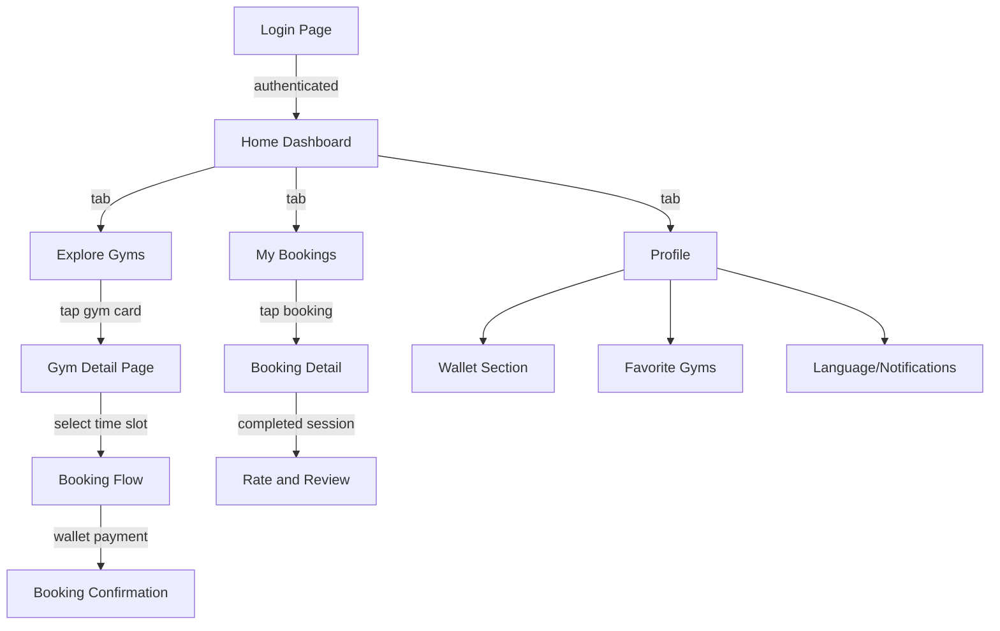
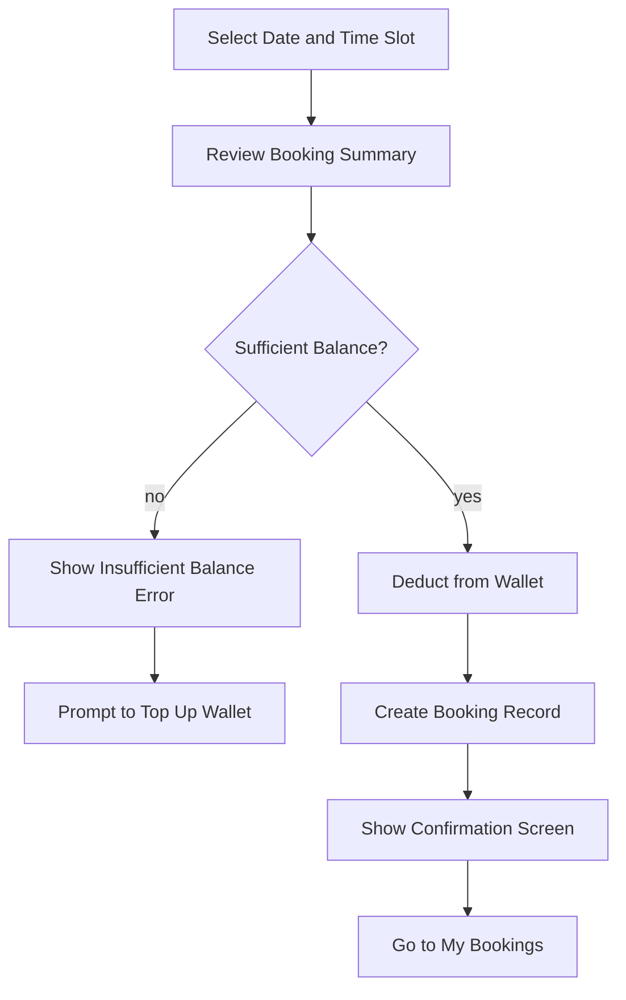
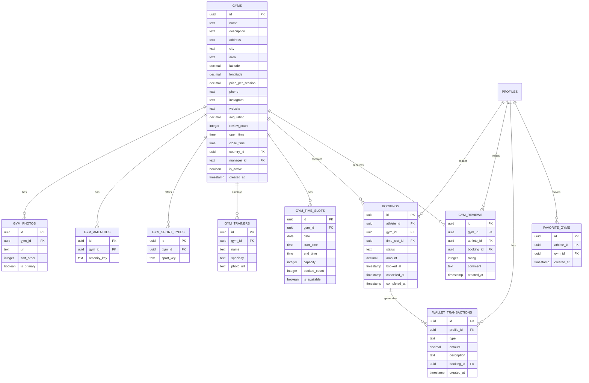

# Athlete Gym Booking Feature — Architecture Plan

## Feature Summary

An Airbnb-like experience for athletes to discover gyms, view details, purchase sessions via wallet, manage bookings, and review gyms. Language adapts based on country selected at login.

---

## User Flow Overview



---

## Navigation Structure

4 bottom tabs with glassmorphic tab bar:

| Tab | Icon | Route | Description |
|-----|------|-------|-------------|
| Home | `Home` lucide | `/` | Dashboard with greeting, wallet, upcoming session, gym recommendations, banners |
| Explore | `Search` lucide | `/gyms` | Gym list with search and full filtering |
| Bookings | `Calendar` lucide | `/bookings` | My bookings with status tabs |
| Profile | `User` lucide | `/profile` | Profile editing, wallet, favorites, settings, logout |

---

## Page Specifications

### 1. Home Dashboard - route: `/`

**Sections from top to bottom:**
1. **Greeting bar** — Athlete name + avatar, notification bell icon
2. **Wallet balance card** — Glass card showing balance with `formatPrice()`, tap to go to wallet
3. **Next upcoming session card** — Gym name, date/time, status badge, tap to view booking
4. **Quick action buttons** — Row of 2-3 glass buttons: Book a Session, Browse Gyms
5. **Promotional banners** — Horizontal carousel of glass cards with offers
6. **Nearby gyms** — Horizontal scroll of mini gym cards
7. **Popular gyms** — Horizontal scroll of mini gym cards
8. **Recently visited** — Horizontal scroll of mini gym cards

### 2. Explore Gyms - route: `/gyms`

**Gym Card details:**
- Photo carousel with swipe
- Gym name
- Full address
- Star rating + review count
- Price per session with `formatPrice()`
- Distance from athlete
- Amenities icons row
- Working hours badge - open/closed
- Available sports types tags

**Filter panel - slide-up sheet:**
- Search by gym name - text input
- Sport type - multi-select chips
- Distance range - slider
- Price range - slider
- Star rating - minimum stars selector
- Amenities - multi-select checkboxes
- City/Area - dropdown

**Sort options:**
- Nearest, Cheapest, Highest Rated, Most Popular

### 3. Gym Detail Page - route: `/gyms/[id]`

**Sections:**
1. **Photo gallery** — Full-width carousel with counter
2. **Basic info** — Name, rating, review count, price per session
3. **About/Description** — Expandable text
4. **Time slot booking** — Calendar date picker + available time slots grid
5. **Trainers list** — Horizontal scroll of trainer cards with name, specialty, photo
6. **Amenities** — Icon grid
7. **Location map** — Interactive map with gym pin
8. **Contact info** — Phone, social media links
9. **Reviews section** — Rating summary + individual reviews
10. **Sticky Buy Session CTA** — Fixed bottom button showing price

### 4. Session Purchase Flow



**Booking summary shows:**
- Gym name and photo
- Selected date and time
- Session price
- Wallet balance before/after
- Confirm button

### 5. My Bookings - route: `/bookings`

**Status tabs with filter:**
- All
- Upcoming
- Active
- Completed
- Cancelled
- Expired

**Booking card shows:**
- Gym name and thumbnail
- Date and time
- Status badge with color coding
- Price paid
- Tap to view detail

**After completed session:** Rate/review prompt appears
- Star rating 1-5
- Text review
- Submit review

### 6. Profile Page - route: `/profile`

**Sections:**
1. **Avatar and name** — Editable with camera icon
2. **Wallet section** — Balance, transaction history list, top-up button
3. **Favorite gyms** — List of saved gyms
4. **Language switcher** — Toggle between supported languages
5. **Notification settings** — Toggle switches
6. **Support/Contact** — Link to support
7. **Terms of service** — Link
8. **Logout button** — Red glass button

---

## Database Schema Design

### New Tables Required



### Booking Status Enum
- `upcoming` — Booked for future date
- `active` — Currently in progress
- `completed` — Session finished
- `cancelled` — Cancelled by athlete
- `expired` — No-show, session passed without check-in

### Wallet Transaction Types
- `top_up` — Added funds
- `session_purchase` — Deducted for booking
- `refund` — Returned from cancellation
- `bonus` — Promotional credit

---

## File Structure

```
athlete-pwa/
  app/
    page.tsx                    # Home dashboard
    gyms/
      page.tsx                  # Explore gyms list
      [id]/
        page.tsx                # Gym detail
    bookings/
      page.tsx                  # My bookings list
      [id]/
        page.tsx                # Booking detail
    profile/
      page.tsx                  # Profile page
    actions/
      auth.ts                   # Existing auth actions
      gyms.ts                   # Gym CRUD server actions
      bookings.ts               # Booking server actions
      wallet.ts                 # Wallet server actions
      reviews.ts                # Review server actions
  components/
    layout/
      bottom-nav.tsx            # Bottom tab navigation
      app-shell.tsx             # Main layout wrapper
    gyms/
      gym-card.tsx              # Gym card for list
      gym-photo-carousel.tsx    # Photo carousel
      gym-filter-sheet.tsx      # Filter slide-up panel
      gym-search-bar.tsx        # Search input
    booking/
      time-slot-picker.tsx      # Calendar + time grid
      booking-summary.tsx       # Booking confirmation card
      booking-card.tsx          # Booking card for list
    profile/
      wallet-card.tsx           # Wallet balance display
      transaction-list.tsx      # Transaction history
    reviews/
      review-card.tsx           # Individual review
      review-form.tsx           # Rate/review form
      star-rating.tsx           # Star rating component
    shared/
      status-badge.tsx          # Booking status badge
      price-tag.tsx             # Price display with currency
      amenity-icon.tsx          # Amenity icon mapper
  lib/
    supabase/
      client.ts                 # Existing
      server.ts                 # Existing
      middleware.ts              # Existing
  supabase/
    migrations/
      xxx_create_gyms_schema.sql
      xxx_seed_gym_data.sql
```

---

## i18n Strategy

Language is determined by the country selected at login:
- `IR` → Farsi - RTL - Vazirmatn font
- `AE` → Arabic - RTL - or Farsi fallback
- `US` → English - LTR
- `TR` → Turkish - LTR - or English fallback

New translation keys needed for all new pages - estimate 80+ new keys across:
- `home.*` — Dashboard labels
- `gyms.*` — Gym list, filters, card labels
- `gymDetail.*` — Detail page sections
- `booking.*` — Booking flow labels
- `bookings.*` — My bookings page
- `profile.*` — Profile sections
- `wallet.*` — Wallet labels
- `reviews.*` — Review form labels
- `common.*` — Shared labels like status names

---

## Implementation Order - Baby Steps

Each phase builds on the previous one and must be validated before moving forward:

1. **Phase 0** — Database schema + seed data in Supabase
2. **Phase 1** — App shell layout with bottom navigation
3. **Phase 2** — Home dashboard with all sections
4. **Phase 3** — Explore gyms list with cards and filtering
5. **Phase 4** — Gym detail page with all sections
6. **Phase 5** — Session purchase flow with wallet deduction
7. **Phase 6** — My Bookings page with status management
8. **Phase 7** — Profile page with all sections
9. **Phase 8** — i18n translation keys
10. **Phase 9** — Seed data for testing
11. **Phase 10** — End-to-end testing
