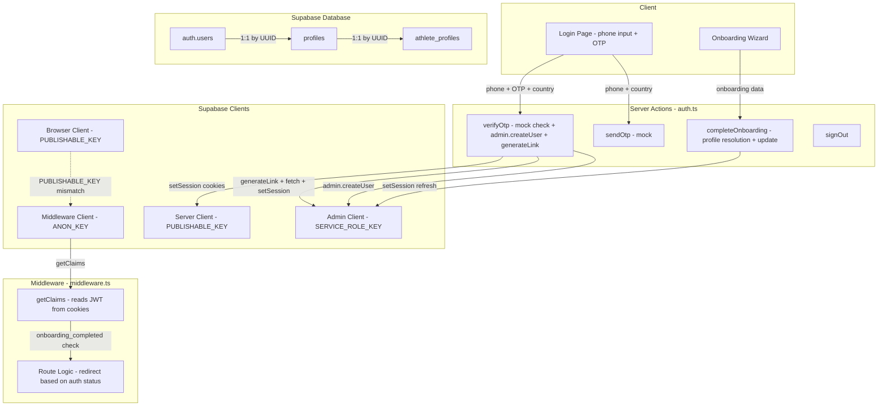
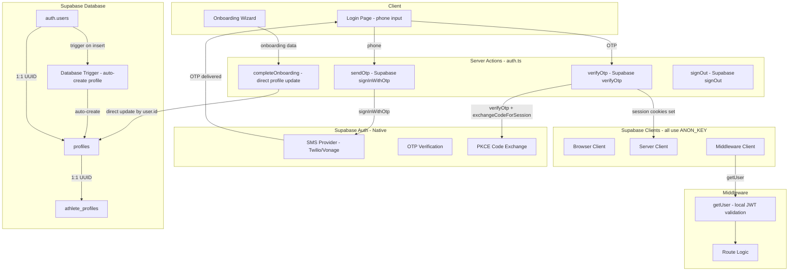
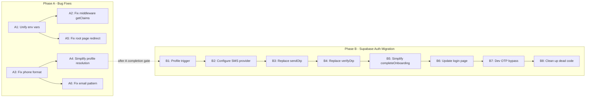

# Auth Bug Fix & Supabase Auth Migration Plan

## Executive Summary

The current authentication system has **8 identified issues** ranging from critical middleware failures to low-priority UX concerns. This plan addresses them in two phases:

- **Phase A** — Fix bugs within the current architecture to achieve a stable, working auth system
- **Phase B** — Migrate to proper Supabase Auth, replacing the custom magic-link workaround with native phone OTP

The plan follows the Baby Steps™ methodology: each step is atomic, validated independently, and documented before proceeding.

---

## Current Architecture Diagram



---

## Phase A: Bug Fixes — Keep Current Architecture

### A1. Unify Environment Variable to ANON_KEY

**Problem:** [`client.ts`](athlete-pwa/lib/supabase/client.ts:6) and [`server.ts`](athlete-pwa/lib/supabase/server.ts:13) use `NEXT_PUBLIC_SUPABASE_PUBLISHABLE_KEY` (`sb_publishable_*` format) while [`middleware.ts`](athlete-pwa/lib/supabase/middleware.ts:14) and [`auth.ts`](athlete-pwa/app/actions/auth.ts:103) use `NEXT_PUBLIC_SUPABASE_ANON_KEY` (JWT format). The `sb_publishable_*` key is a different credential type that does not work with Supabase Auth operations.

**Files to change:**
- [`athlete-pwa/lib/supabase/client.ts`](athlete-pwa/lib/supabase/client.ts) — Change `NEXT_PUBLIC_SUPABASE_PUBLISHABLE_KEY` → `NEXT_PUBLIC_SUPABASE_ANON_KEY`
- [`athlete-pwa/lib/supabase/server.ts`](athlete-pwa/lib/supabase/server.ts) — Change `NEXT_PUBLIC_SUPABASE_PUBLISHABLE_KEY` → `NEXT_PUBLIC_SUPABASE_ANON_KEY`

**Validation:**
- Run `npm run build` to confirm no type errors
- Test login flow: enter phone → enter OTP 123456 → verify session cookies are set
- Check browser DevTools Application > Cookies for `sb-*-auth-token` cookies

---

### A2. Fix Middleware `getClaims()` Reliability

**Problem:** [`middleware.ts`](athlete-pwa/lib/supabase/middleware.ts:36) calls `supabase.auth.getClaims()` which internally fetches JWK from Supabase. In Edge Runtime, this network fetch can fail intermittently, causing all requests to be treated as unauthenticated → infinite redirect loops.

**Solution:** Replace `getClaims()` with `getUser()`, which validates the JWT signature locally without an additional network call. The `@supabase/ssr` `createServerClient` already handles session refresh in the `setAll` callback.

**Files to change:**
- [`athlete-pwa/lib/supabase/middleware.ts`](athlete-pwa/lib/supabase/middleware.ts) — Replace `getClaims()` with `getUser()` and adjust the onboarding check

**Change detail:**
```typescript
// BEFORE (lines 34-41):
let user: Record<string, unknown> | undefined
try {
  const { data } = await supabase.auth.getClaims()
  user = data?.claims as Record<string, unknown> | undefined
} catch {
  user = undefined
}

// AFTER:
const { data: { user } } = await supabase.auth.getUser()
```

And update the onboarding check to read from `user?.app_metadata` instead of casting.

**Validation:**
- Test middleware does not crash when no session exists
- Test authenticated user can access protected routes
- Test unauthenticated user is redirected to `/login`
- Test onboarding redirect works for users with `onboarding_completed: false`
- Monitor server console for JWK fetch errors — should be gone

---

### A3. Fix Phone Format Normalization

**Problem:** [`verifyOtp()`](athlete-pwa/app/actions/auth.ts:243) stores raw phone input in `profiles.mobile_number` (e.g., `09121234567`) while [`admin.createUser()`](athlete-pwa/app/actions/auth.ts:222) stores E.164 in `auth.users.phone` (e.g., `+989121234567`). This causes lookup failures in [`completeOnboarding()`](athlete-pwa/app/actions/auth.ts:375-391) which tries multiple phone variants.

**Solution:** Standardize on E.164 format in `profiles.mobile_number`. Update the insert in `verifyOtp()` and add a migration to fix existing records.

**Files to change:**
- [`athlete-pwa/app/actions/auth.ts`](athlete-pwa/app/actions/auth.ts) — In `verifyOtp()`, change `mobile_number: phone` to `mobile_number: phoneE164` (line 243)
- Create a new SQL migration to update existing `profiles.mobile_number` values to E.164

**Migration SQL:**
```sql
-- Normalize existing profiles.mobile_number to E.164 format
-- Iran: strip leading 0, prepend +98
UPDATE profiles
SET mobile_number = '+98' || SUBSTRING(mobile_number FROM 2)
WHERE mobile_number LIKE '09%' AND LENGTH(mobile_number) = 11;

-- UAE: strip leading 0, prepend +971
UPDATE profiles
SET mobile_number = '+971' || SUBSTRING(mobile_number FROM 2)
WHERE mobile_number LIKE '05%' AND LENGTH(mobile_number) = 10;
```

**Validation:**
- Create a new user via login flow → check `profiles.mobile_number` is E.164
- Check `auth.users.phone` matches `profiles.mobile_number` for the new user
- Run migration on existing data → verify no orphaned records
- Test `completeOnboarding()` with a user created before the fix

---

### A4. Simplify Profile Resolution in `completeOnboarding()`

**Problem:** [`completeOnboarding()`](athlete-pwa/app/actions/auth.ts:349-399) uses 5+ fallback strategies to resolve the profile ID: direct UUID match → phone from `user_metadata` → phone from `user.phone` → phone from `app_metadata` → phone variants with/without leading 0. This is fragile.

**Solution:** After A3 (phone normalization), the profile can always be found by a direct UUID match OR a single E.164 phone lookup. Simplify to: try direct UUID match, then single E.164 phone lookup from `user.phone`.

**Files to change:**
- [`athlete-pwa/app/actions/auth.ts`](athlete-pwa/app/actions/auth.ts) — Replace the multi-strategy profile resolution in `completeOnboarding()` with a simple two-step lookup

**Change detail:**
```typescript
// Step 1: Direct match by auth user ID
const { data: directProfile } = await admin
  .from("profiles")
  .select("id")
  .eq("id", authUserId)
  .is("deleted_at", null)
  .single()

if (directProfile) {
  profileId = directProfile.id
} else {
  // Step 2: Lookup by E.164 phone from auth user
  const phone = user.phone
  if (!phone) {
    return { success: false, error: "Profile not found" }
  }
  const { data: phoneProfile } = await admin
    .from("profiles")
    .select("id")
    .eq("mobile_number", phone)
    .is("deleted_at", null)
    .single()

  if (!phoneProfile) {
    return { success: false, error: "Profile not found" }
  }
  profileId = phoneProfile.id
}
```

**Validation:**
- Test onboarding for a new user (profile created by `verifyOtp`)
- Test onboarding for an existing user (profile already exists)
- Verify no more phone variant loops in server logs

---

### A5. Fix Root Page Unconditional Redirect

**Problem:** [`app/page.tsx`](athlete-pwa/app/page.tsx:4) does `redirect("/home")` unconditionally, which runs as a Server Component before middleware can intercept. This means visiting `/` always redirects to `/home` even for unauthenticated users, causing a double redirect (`/` → `/home` → `/login`).

**Solution:** Remove the `redirect()` from the root page and instead let middleware handle the routing. The root page should either redirect to `/login` or let middleware decide.

**Files to change:**
- [`athlete-pwa/app/page.tsx`](athlete-pwa/app/page.tsx) — Replace unconditional redirect with a check or remove the page entirely and handle routing in middleware

**Change detail:**
```typescript
// Option A: Check auth and redirect accordingly
import { createClient } from "@/lib/supabase/server"
import { redirect } from "next/navigation"

export default async function RootPage() {
  const supabase = await createClient()
  const { data: { user } } = await supabase.auth.getUser()

  if (!user) {
    redirect("/login")
  }

  const appMeta = user.app_metadata as Record<string, unknown>
  if (appMeta?.onboarding_completed !== true) {
    redirect("/onboarding")
  }

  redirect("/home")
}
```

**Validation:**
- Visit `/` while unauthenticated → should redirect directly to `/login` (not via `/home`)
- Visit `/` while authenticated but not onboarded → should redirect to `/onboarding`
- Visit `/` while fully authenticated → should redirect to `/home`

---

### A6. Fix Internal Email Pattern Consistency

**Problem:** [`verifyOtp()`](athlete-pwa/app/actions/auth.ts:217) creates auth users with email `{rawPhone}@auth.rokhdad.internal` (e.g., `09121234567@auth.rokhdad.internal`) but [`setSessionFromMagicLink()`](athlete-pwa/app/actions/auth.ts:264) is called with the same raw phone pattern. However, the `toE164()` function produces a different string. If the phone format stored in the email ever changes, the magic link lookup breaks.

**Solution:** Standardize the internal email to always use E.164 format: `{phoneE164}@auth.rokhdad.internal`. Update both the user creation and the magic link generation.

**Files to change:**
- [`athlete-pwa/app/actions/auth.ts`](athlete-pwa/app/actions/auth.ts) — Change line 217 from `${phone}@auth.rokhdad.internal` to `${phoneE164}@auth.rokhdad.internal`
- Update line 264 to use the same E.164 format
- Create a SQL migration to update existing auth.users emails to E.164 format

**Validation:**
- Create a new user → verify `auth.users.email` is `{E.164}@auth.rokhdad.internal`
- Test login with existing user → verify magic link still works
- Test complete onboarding → verify session refresh still works

---

## Phase A Completion Gate

Before proceeding to Phase B, validate:

- [ ] All Phase A steps pass their individual validations
- [ ] Full login → onboarding → home flow works end-to-end
- [ ] Middleware correctly redirects in all scenarios
- [ ] No `PUBLISHABLE_KEY` references remain in the codebase
- [ ] Phone numbers are consistently E.164 in both `auth.users` and `profiles`
- [ ] Server logs show no JWK fetch errors

---

## Phase B: Migrate to Proper Supabase Auth

### Target Architecture Diagram



---

### B1. Create Database Trigger for Auto-Profile Creation

**Problem:** Currently, [`verifyOtp()`](athlete-pwa/app/actions/auth.ts:237-252) manually creates a `profiles` row after creating the auth user. This couples auth logic with profile management.

**Solution:** Create a PostgreSQL trigger that automatically inserts a `profiles` row when a new user is added to `auth.users`. This eliminates the need for manual profile creation in the server action.

**Files to change:**
- Create new migration: `athlete-pwa/supabase/migrations/YYYYMMDD_create_profile_trigger.sql`

**Migration SQL:**
```sql
-- Function to auto-create profile on user insert
CREATE OR REPLACE FUNCTION public.handle_new_user()
RETURNS trigger
LANGUAGE plpgsql
SECURITY DEFINER
AS $$
BEGIN
  INSERT INTO public.profiles (id, mobile_number, role, wallet_balance, onboarding_completed)
  VALUES (
    NEW.id,
    COALESCE(NEW.phone, ''),
    COALESCE(NEW.raw_app_meta_data->>'role', 'athlete'),
    0,
    false
  );
  RETURN NEW;
END;
$$;

-- Trigger on auth.users insert
CREATE TRIGGER on_auth_user_created
  AFTER INSERT ON auth.users
  FOR EACH ROW
  EXECUTE FUNCTION public.handle_new_user();
```

**Validation:**
- Insert a test user via `admin.createUser()` → verify `profiles` row is auto-created
- Verify the profile has correct defaults: `role = 'athlete'`, `onboarding_completed = false`
- Delete test user → verify profile cleanup (if cascade is set)

---

### B2. Configure Supabase Phone Auth Provider

**Problem:** The current system uses a hardcoded mock OTP (`123456`). No real SMS is sent.

**Solution:** Enable Supabase's built-in phone auth provider in the Supabase Dashboard. This requires configuring an SMS provider (Twilio, Vonage, or MessageBird).

**Steps:**
1. Go to Supabase Dashboard → Authentication → Providers → Phone
2. Enable the Phone provider
3. Configure SMS provider credentials (Twilio Account SID, Auth Token, Message Service SID)
4. Set the OTP expiry (recommended: 60 seconds)
5. Configure the SMS template

**For development:** Keep mock OTP working by using Supabase's test phone numbers or by adding a development bypass.

**Files to change:**
- Supabase Dashboard configuration (no code changes)
- Optionally update [`athlete-pwa/supabase/config.toml`](athlete-pwa/supabase/config.toml) for local development

**Validation:**
- Send a test OTP via Supabase Dashboard → verify SMS is received
- Verify OTP via Dashboard → confirm it works
- Test with invalid OTP → confirm error response

---

### B3. Replace `sendOtp()` with `signInWithOtp()`

**Problem:** [`sendOtp()`](athlete-pwa/app/actions/auth.ts:135-144) is a mock that only validates phone length and returns success.

**Solution:** Replace with Supabase's `signInWithOtp({ phone })` which sends a real SMS OTP.

**Files to change:**
- [`athlete-pwa/app/actions/auth.ts`](athlete-pwa/app/actions/auth.ts) — Rewrite `sendOtp()` to use Supabase phone OTP

**Change detail:**
```typescript
export async function sendOtp(phone: string, countryCode: string = "IR"): Promise<{ success: boolean; error?: string }> {
  if (!phone || phone.length < 8) {
    return { success: false, error: "Invalid phone number" }
  }

  const phoneE164 = toE164(phone, countryCode)
  const supabase = createAdminClient()

  const { error } = await supabase.auth.signInWithOtp({
    phone: phoneE164,
    options: {
      shouldCreateUser: true,
      data: {
        role: "athlete",
        phone: phoneE164,
      },
    },
  })

  if (error) {
    console.error("[AUTH] Error sending OTP:", error)
    return { success: false, error: error.message }
  }

  console.log(`[AUTH] OTP sent to ${phoneE164}`)
  return { success: true }
}
```

**Validation:**
- Call `sendOtp("09121234567", "IR")` → verify SMS is received
- Check Supabase Dashboard → Authentication → Logs for the OTP event
- Test with invalid phone → verify error response

---

### B4. Replace `verifyOtp()` with Supabase OTP Verification

**Problem:** [`verifyOtp()`](athlete-pwa/app/actions/auth.ts:163-280) uses a mock OTP check, manually creates auth users, generates magic links, fetches verification URLs, and extracts tokens from HTML. This is a 120-line workaround that should be a 10-line Supabase call.

**Solution:** Replace with Supabase's `verifyOtp({ phone, token, type: 'sms' })` which handles user creation, verification, and session management natively.

**Files to change:**
- [`athlete-pwa/app/actions/auth.ts`](athlete-pwa/app/actions/auth.ts) — Rewrite `verifyOtp()` to use native Supabase OTP verification

**Change detail:**
```typescript
export async function verifyOtp(
  phone: string,
  otp: string,
  countryCode: string = "IR"
): Promise<AuthResult> {
  const phoneE164 = toE164(phone, countryCode)
  const cookieStore = await cookies()
  const supabase = createServerClient(
    process.env.NEXT_PUBLIC_SUPABASE_URL!,
    process.env.NEXT_PUBLIC_SUPABASE_ANON_KEY!,
    {
      cookies: {
        getAll() { return cookieStore.getAll() },
        setAll(cookiesToSet) {
          cookiesToSet.forEach(({ name, value, options }) => {
            cookieStore.set(name, value, options)
          })
        },
      },
    }
  )

  const { data, error } = await supabase.auth.verifyOtp({
    phone: phoneE164,
    token: otp,
    type: "sms",
  })

  if (error) {
    console.error("[AUTH] OTP verification failed:", error)
    return { success: false, error: error.message }
  }

  const user = data.user
  const admin = createAdminClient()

  // Fetch profile (auto-created by trigger from B1)
  const { data: profile } = await admin
    .from("profiles")
    .select("*")
    .eq("id", user.id)
    .is("deleted_at", null)
    .single()

  // Update app_metadata for JWT claims
  await admin.auth.admin.updateUserById(user.id, {
    app_metadata: {
      onboarding_completed: profile?.onboarding_completed ?? false,
    },
  })

  return {
    success: true,
    profile: profile ? {
      id: profile.id,
      mobile_number: profile.mobile_number,
      role: profile.role,
      full_name: profile.full_name,
      onboarding_completed: profile.onboarding_completed,
    } : undefined,
  }
}
```

**This also eliminates:**
- The `setSessionFromMagicLink()` helper function (lines 51-129) — no longer needed
- The `createAdminClient()` usage for user creation — Supabase handles it
- The internal email pattern `{phone}@auth.rokhdad.internal` — no longer needed
- The multi-strategy phone variant lookup — single E.164 lookup suffices

**Validation:**
- Enter phone → receive real OTP → enter OTP → verify session is established
- Check cookies in browser DevTools → `sb-*-auth-token` should be set
- Test with wrong OTP → verify error response
- Test new user → verify `auth.users` and `profiles` rows are created
- Test existing user → verify profile is found correctly

---

### B5. Simplify `completeOnboarding()` — Remove Magic Link Refresh

**Problem:** [`completeOnboarding()`](athlete-pwa/app/actions/auth.ts:477-485) calls `setSessionFromMagicLink()` to refresh the session after updating `app_metadata`. This is needed so the middleware sees the updated `onboarding_completed` claim in the JWT.

**Solution:** After updating `app_metadata`, use `supabase.auth.refreshSession()` to force a token refresh instead of the magic link workaround. The refreshed token will contain the updated claims.

**Files to change:**
- [`athlete-pwa/app/actions/auth.ts`](athlete-pwa/app/actions/auth.ts) — Replace `setSessionFromMagicLink()` call with `refreshSession()`

**Change detail:**
```typescript
// Replace lines 477-485 with:
await admin.auth.admin.updateUserById(authUserId, {
  app_metadata: { onboarding_completed: true },
})

// Refresh session to get updated JWT
const { error: refreshError } = await supabase.auth.refreshSession()
if (refreshError) {
  console.warn("[ONBOARDING] Session refresh failed:", refreshError)
  // Non-critical — session will refresh on next request
}
```

After this change, the entire `setSessionFromMagicLink()` function can be deleted.

**Validation:**
- Complete onboarding → verify redirect to `/home` works immediately
- Check middleware logs → `onboarding_completed` should be `true` in claims
- Test that `setSessionFromMagicLink` is no longer called anywhere

---

### B6. Update Login Page for Real OTP Flow

**Problem:** The login page has a hardcoded mock OTP hint at the bottom and does not pass `countryCode` to `sendOtp()`.

**Solution:** Update the login page to pass the country code to `sendOtp()` and remove the mock OTP hint.

**Files to change:**
- [`athlete-pwa/app/login/page.tsx`](athlete-pwa/app/login/page.tsx) — Update `handleSendOtp` to pass `countryCode`, remove mock OTP footer

**Change detail:**
1. Update `handleSendOtp` callback (line 102):
   ```typescript
   const result = await sendOtp(trimmed, selectedCountry)
   ```
2. Remove the mock OTP footer (lines 392-394):
   ```typescript
   // DELETE:
   <p className="mt-6 text-center text-[10px] text-white/20">
     Mock OTP: 123456
   </p>
   ```

**Validation:**
- Test login flow: select country → enter phone → click send → verify OTP input appears
- Verify no mock OTP hint is displayed
- Verify the country code is passed correctly to the server action

---

### B7. Add Development Mode OTP Bypass

**Problem:** During development, real SMS costs money and requires a real phone number. We need a way to bypass OTP for local testing.

**Solution:** Add a development-only OTP bypass that accepts a configurable dev OTP when `NODE_ENV === 'development'`.

**Files to change:**
- [`athlete-pwa/app/actions/auth.ts`](athlete-pwa/app/actions/auth.ts) — Add dev OTP check in `verifyOtp()`
- [`athlete-pwa/.env.local`](athlete-pwa/.env.local) — Add `DEV_OTP` variable

**Change detail:**
```typescript
// In verifyOtp(), before the Supabase verifyOtp call:
if (process.env.NODE_ENV === "development" && process.env.DEV_OTP) {
  if (otp === process.env.DEV_OTP) {
    // Bypass: create or find user directly
    // ... simplified dev flow
  }
}
```

**Validation:**
- Set `DEV_OTP=123456` in `.env.local`
- Test login with OTP `123456` in development → should work
- Test login with wrong OTP → should fail
- In production build → verify bypass is disabled

---

### B8. Clean Up Dead Code

**Problem:** After Phase B migration, several pieces of the old auth system become dead code.

**Solution:** Remove all unused code.

**Files to change:**
- [`athlete-pwa/app/actions/auth.ts`](athlete-pwa/app/actions/auth.ts) — Remove:
  - `setSessionFromMagicLink()` function (lines 51-129)
  - `MOCK_OTP` constant (line 132)
  - The internal email pattern logic
  - The multi-strategy phone variant lookup in `verifyOtp()`
  - The manual `admin.auth.admin.createUser()` call in `verifyOtp()`
  - The manual profile insert in `verifyOtp()`

**Validation:**
- Run `npm run build` — no errors
- Run `npx tsc --noEmit` — no type errors
- Full login → onboarding → home flow still works
- Sign out → login again → works

---

## Phase B Completion Gate

Before considering the migration complete:

- [ ] Real SMS OTP is sent and verified
- [ ] No `setSessionFromMagicLink` references remain
- [ ] No `generateLink` references remain
- [ ] No `@auth.rokhdad.internal` email pattern remains
- [ ] No `MOCK_OTP` constant remains
- [ ] Profile auto-creation trigger works
- [ ] All Supabase clients use `NEXT_PUBLIC_SUPABASE_ANON_KEY`
- [ ] Middleware uses `getUser()` (not `getClaims()`)
- [ ] Dev OTP bypass works in development mode
- [ ] Full E2E flow: login → OTP → onboarding → home → sign out → login

---

## Risk Assessment

| Risk | Likelihood | Impact | Mitigation |
|------|-----------|--------|------------|
| SMS provider downtime | Medium | High — users cannot log in | Keep dev OTP bypass as fallback; monitor provider status |
| Existing users orphaned after migration | Low | High — users cannot access accounts | Run migration scripts to normalize phone numbers and emails before switching |
| Database trigger fails silently | Low | Medium — profile not created | Add monitoring/logging to trigger; test thoroughly |
| Middleware session validation regression | Medium | High — auth breaks for all users | Phase A fixes this first; test all middleware paths |
| Supabase Auth API changes | Low | Medium — code needs updates | Pin `@supabase/ssr` version; review changelogs |
| Phone number format edge cases | Medium | Medium — some users cannot log in | Comprehensive phone normalization with tests |

---

## Rollback Strategy

### Phase A Rollback
Each Phase A step is independent and can be reverted individually:
1. Revert the specific git commit for the failing step
2. All other Phase A fixes remain in place

### Phase B Rollback
Phase B is more complex. Rollback strategy:
1. **Before starting Phase B:** Create a git branch `auth-migration` from main
2. **Each Phase B step** is a separate commit for surgical rollback
3. **If Phase B fails catastrophically:**
   - Revert to main branch (Phase A fixes only)
   - Re-enable mock OTP temporarily
   - The database trigger is harmless if it fails — profiles can still be created manually
4. **Data migration rollback:**
   - Keep backup of `profiles.mobile_number` before E.164 migration
   - Keep backup of `auth.users.email` before email pattern change

### Environment Variable Rollback
If unifying to ANON_KEY causes issues:
1. Restore `NEXT_PUBLIC_SUPABASE_PUBLISHABLE_KEY` in `.env.local`
2. Revert [`client.ts`](athlete-pwa/lib/supabase/client.ts) and [`server.ts`](athlete-pwa/lib/supabase/server.ts) to use PUBLISHABLE_KEY
3. Investigate why ANON_KEY doesn't work for browser/server clients

---

## Dependency Order Summary



---

## Files Changed Summary

| File | Phase A | Phase B |
|------|---------|---------|
| [`athlete-pwa/.env.local`](athlete-pwa/.env.local) | — | Add DEV_OTP |
| [`athlete-pwa/app/page.tsx`](athlete-pwa/app/page.tsx) | A5 | — |
| [`athlete-pwa/app/login/page.tsx`](athlete-pwa/app/login/page.tsx) | — | B6 |
| [`athlete-pwa/app/actions/auth.ts`](athlete-pwa/app/actions/auth.ts) | A3, A4, A6 | B3, B4, B5, B7, B8 |
| [`athlete-pwa/lib/supabase/client.ts`](athlete-pwa/lib/supabase/client.ts) | A1 | — |
| [`athlete-pwa/lib/supabase/server.ts`](athlete-pwa/lib/supabase/server.ts) | A1 | — |
| [`athlete-pwa/lib/supabase/middleware.ts`](athlete-pwa/lib/supabase/middleware.ts) | A2 | — |
| [`athlete-pwa/supabase/migrations/`](athlete-pwa/supabase/migrations/) | A3 | B1 |
| [`athlete-pwa/supabase/config.toml`](athlete-pwa/supabase/config.toml) | — | B2 |
