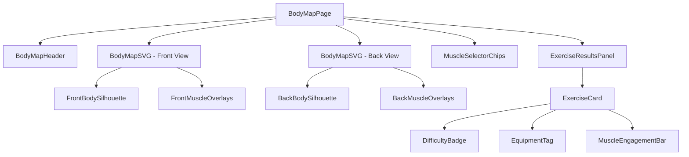
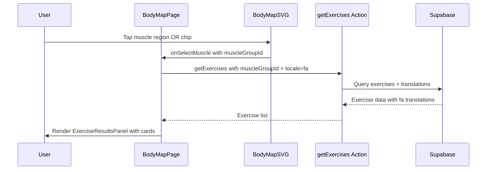

# Body Map Page Redesign Plan

## Current State Analysis

The body map page at [`athlete-pwa/app/(athlete)/body-map/page.tsx`](athlete-pwa/app/(athlete)/body-map/page.tsx) has **10 major UI/UX problems**:

### Problems Identified

| # | Problem | Severity |
|---|---------|----------|
| 1 | **Crude SVG body** — built from basic geometric primitives (ellipse for head, simple paths for torso/arms/legs). Looks like a rough wireframe sketch, not a polished fitness app | Critical |
| 2 | **Muscle overlay paths misaligned** — hardcoded coordinates don't properly map to body outline regions. Overlaps and gaps between muscle regions | Critical |
| 3 | **Incomplete muscle mapping** — DB has 16 muscle groups but page only maps 10. Missing: `forearms`, `traps`, `neck`, `core`, `full_body`, `cardio` | High |
| 4 | **Tiny dot indicators** — 3px radius circles nearly invisible on mobile. No text labels on the SVG itself | High |
| 5 | **No front/back silhouette difference** — same generic body shape for both views. A real body map needs distinct front-facing and back-facing silhouettes | Critical |
| 6 | **Poor color contrast** — unselected muscles at `rgba(79,142,247,0.05)` are invisible against `#2C2C2E`. Hover at 0.25 is also subtle | High |
| 7 | **Small SVG container** — `w-64` (256px) too small for mobile touch interaction | Medium |
| 8 | **Tiny muscle chips** — `text-xs` with `px-3 py-1.5`, hard to tap on mobile | Medium |
| 9 | **Bare exercise list** — minimal cards with just name + tiny difficulty/type text. No images, equipment tags, or muscle engagement indicators | Medium |
| 10 | **RTL + SVG mismatch** — `dir="rtl"` on page but SVG coordinates are absolute and don't flip, causing left/right confusion | Medium |

---

## Redesign Architecture

### Approach: Custom SVG with Proper Anatomical Illustrations

Using `react-body-highlighter` was considered but rejected because:
- Potential React 19 compatibility issues
- Limited control over styling to match the Hevy dark design system
- Cannot customize muscle group mapping to match our DB schema
- No RTL support

Custom SVG approach gives full control over:
- Styling consistency with the Hevy dark theme
- Proper front/back anatomical silhouettes
- Accurate muscle region mapping to DB `muscle_groups` IDs
- RTL-aware label positioning
- Touch-friendly interaction areas

### Component Architecture



### Data Flow



---

## Implementation Steps

### Step 1: Create `BodyMapSVG` Component

**File:** `athlete-pwa/components/body-map/BodyMapSVG.tsx`

- Create two distinct SVG illustrations: front-facing and back-facing human body silhouettes
- Use proper anatomical proportions with a larger viewBox (e.g., `0 0 200 400`)
- Body outline should use `#2C2C2E` fill with `#3A3A3C` stroke (matching design system)
- Each muscle group gets a well-defined, anatomically accurate clickable `<path>` overlay
- Overlays should have generous touch targets (min 44x44px equivalent)
- Selected muscle: `fill: rgba(79,142,247,0.35)` with `stroke: #4F8EF7` strokeWidth 2
- Hovered muscle: `fill: rgba(79,142,247,0.15)` with subtle stroke
- Unselected but visible: `fill: rgba(79,142,247,0.08)` — visible enough to indicate interactivity
- Add small label text inside each muscle region using `<text>` elements with `font-size: 8` in Persian

**Muscle group mapping to DB IDs:**

| DB ID | Persian Label | Front View | Back View |
|-------|--------------|------------|-----------|
| `shoulders` | سرشانه | ✓ | ✓ |
| `chest` | سینه | ✓ | — |
| `biceps` | جلو بازو | ✓ | — |
| `triceps` | پشت بازو | — | ✓ |
| `forearms` | ساعد | ✓ | ✓ |
| `abs` | شکم | ✓ | — |
| `core` | هسته | ✓ | — |
| `quads` | جلو ران | ✓ | — |
| `calves` | ساق پا | ✓ | ✓ |
| `back` | پشت | — | ✓ |
| `traps` | ذوزنقه | — | ✓ |
| `glutes` | باسن | — | ✓ |
| `hamstrings` | پشت ران | — | ✓ |
| `neck` | گردن | ✓ | ✓ |

### Step 2: Create `MuscleSelectorChips` Component

**File:** `athlete-pwa/components/body-map/MuscleSelectorChips.tsx`

- Replace tiny `text-xs` chips with larger, mobile-friendly tap targets
- Use `px-4 py-2.5 rounded-xl text-sm font-medium` sizing
- Selected chip: `bg-[#4F8EF7] text-white shadow-lg shadow-[#4F8EF7]/20`
- Unselected chip: `bg-[#2C2C2E] text-white/50 border border-[#3A3A3C]`
- Add muscle icon from DB seed data (emoji icons)
- Chips scroll horizontally in a `flex-wrap` container
- Only show chips relevant to current view (front/back)

### Step 3: Create `ExerciseCard` Component

**File:** `athlete-pwa/components/body-map/ExerciseCard.tsx`

- Richer exercise cards with:
  - Exercise name (Persian translation preferred, English fallback)
  - Difficulty badge: colored pill (`beginner=green`, `intermediate=orange`, `advanced=red`)
  - Equipment type tag: small icon + label
  - Exercise type indicator: compound vs isolation
  - Secondary muscle groups: tiny dots or mini labels
  - Right arrow for navigation to exercise detail
- Card styling: `bg-[#2C2C2E] rounded-2xl p-3.5 border border-[#3A3A3C]/50`
- Hover/tap: subtle scale + border highlight

### Step 4: Create `ExerciseResultsPanel` Component

**File:** `athlete-pwa/components/body-map/ExerciseResultsPanel.tsx`

- Animated panel that slides up when a muscle is selected
- Header with muscle Persian label + exercise count
- `Dumbbell` icon in header (keep current pattern)
- Loading state: 3 skeleton cards with proper sizing
- Empty state: friendly message with suggestion to try another muscle
- Exercise list with `ExerciseCard` components
- Max 20 exercises with "show more" if needed

### Step 5: Redesign `BodyMapPage`

**File:** `athlete-pwa/app/(athlete)/body-map/page.tsx`

- Remove all inline SVG code — delegate to `BodyMapSVG` component
- Page layout structure:
  ```
  ┌─────────────────────────┐
  │  Header (sticky)        │
  │  🦴 نقشه بدن            │
  │  [جلو] [پشت] toggle    │
  ├─────────────────────────┤
  │                         │
  │   ┌───────────────┐     │
  │   │  BodyMapSVG   │     │
  │   │  (w-80 h-auto)│     │
  │   └───────────────┘     │
  │                         │
  ├─────────────────────────┤
  │  MuscleSelectorChips    │
  │  [سرشانه] [سینه] [...] │
  ├─────────────────────────┤
  │  ExerciseResultsPanel   │
  │  (if muscle selected)   │
  │  ┌─ ExerciseCard ──┐   │
  │  ┌─ ExerciseCard ──┐   │
  │  ┌─ ExerciseCard ──┐   │
  └─────────────────────────┘
  ```
- SVG container: `w-80` (320px) — larger than current `w-64`
- Front/back toggle: styled as pill buttons matching the design system
- Smooth `AnimatePresence` transition between front/back views
- Remove `dir="rtl"` from outer container (RTL is handled per-element)
- Keep `pb-24` for bottom nav clearance

### Step 6: Add CSS Utilities

**File:** `athlete-pwa/app/globals.css`

- Add `.muscle-region` utility for consistent SVG muscle styling
- Add `.muscle-region-active` for selected state
- Add `.muscle-region-hover` for hover state
- Ensure these work with the Hevy dark theme variables

### Step 7: Verify Muscle Group ID Alignment

- Ensure all `muscleGroupId` values used in the body map match exactly with the DB `muscle_groups.id` column values: `chest`, `back`, `shoulders`, `biceps`, `triceps`, `forearms`, `quads`, `hamstrings`, `glutes`, `calves`, `abs`, `traps`, `neck`, `core`
- The `getExercises` action already supports `muscleGroupId` filtering — no changes needed there

---

## Visual Comparison

### Before (Current)
- Crude geometric body shape
- Nearly invisible muscle regions
- Tiny 3px dots as indicators  
- 256px wide SVG
- Minimal exercise cards
- Only 10 of 16 muscle groups mapped

### After (Redesigned)
- Anatomically accurate front/back silhouettes
- Clearly visible, tappable muscle regions with labels
- 320px wide SVG with generous touch targets
- Rich exercise cards with difficulty, equipment, type badges
- All 14 relevant muscle groups mapped (excluding `full_body` and `cardio` which aren't body regions)
- Smooth animations and proper RTL handling

---

## Files to Create/Modify

| File | Action |
|------|--------|
| `athlete-pwa/components/body-map/BodyMapSVG.tsx` | **Create** — Main SVG body map component with front/back views |
| `athlete-pwa/components/body-map/MuscleSelectorChips.tsx` | **Create** — Mobile-friendly muscle selection chips |
| `athlete-pwa/components/body-map/ExerciseCard.tsx` | **Create** — Rich exercise result card |
| `athlete-pwa/components/body-map/ExerciseResultsPanel.tsx` | **Create** — Animated exercise results panel |
| `athlete-pwa/app/(athlete)/body-map/page.tsx` | **Modify** — Complete rewrite using new components |
| `athlete-pwa/app/globals.css` | **Modify** — Add muscle region CSS utilities |