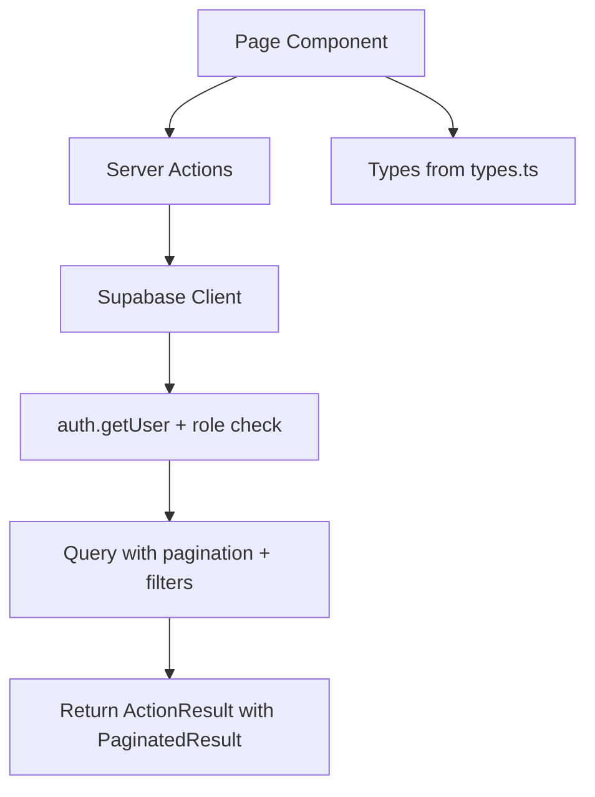

# 🏗️ Implementation Plan: Gap Analysis Report

> **Source**: [`plans/gap-analysis-report.md`](plans/gap-analysis-report.md)
> **Status**: P0 ✅ All Fixed | P1-P3 → Implementation Required

---

## Overview

The gap analysis identifies **4 P1 blockers**, **9 P2 feature gaps**, and **3 P3 config disconnects**. This plan breaks each into precise, file-level implementation steps following the proven patterns already established in the adminpanel codebase.

---

## Architecture: Current Admin Panel Pattern

All existing pages follow the consistent pattern observed in [`adminpanel/app/(dashboard)/dashboard/bookings/page.tsx`](adminpanel/app/(dashboard)/dashboard/bookings/page.tsx:1):



**Key conventions**:
- `'use client'` directive on all page components
- Server actions in [`adminpanel/app/actions/`](adminpanel/app/actions/) with `'use server'`
- Types in [`adminpanel/app/actions/types.ts`](adminpanel/app/actions/types.ts:1)
- [`ActionResult`](adminpanel/app/actions/types.ts:124) + [`PaginatedResult`](adminpanel/app/actions/types.ts:130) response wrappers
- Auth check + role verification in every server action
- RTL layout via `dir="rtl"` in [`layout.tsx`](adminpanel/app/(dashboard)/layout.tsx:36)
- Sidebar navigation in [`admin-sidebar.tsx`](adminpanel/components/admin/admin-sidebar.tsx:15) with role-based filtering

---

## Phase 1: Must Fix for Admin Panel to Be Functional

### 1.1 — Create Missing Admin Pages

Three sidebar links point to routes with no page files. Backend actions already exist.

#### 1.1.1 — Trainers Page

**File**: `adminpanel/app/(dashboard)/dashboard/trainers/page.tsx`

**Pattern**: Follow [`bookings/page.tsx`](adminpanel/app/(dashboard)/dashboard/bookings/page.tsx) pattern — client component, table view, pagination, search, CRUD modal.

**Backend**: [`trainers.ts`](adminpanel/app/actions/trainers.ts) already has `getGymTrainers` + `getAllTrainers` + `createTrainer` + `updateTrainer` + `deleteTrainer`.

**UI Requirements**:
- Table columns: name, specialty, photo_url, gym_name, created_at
- Search by trainer name
- Filter by gym_id for admin role
- Create/Edit modal with fields: name, specialty, photo_url, gym_id selector
- Delete confirmation dialog
- Role visibility: admin sees all trainers across gyms; gym_manager sees only their gym's trainers

#### 1.1.2 — Time Slots Page

**File**: `adminpanel/app/(dashboard)/dashboard/time-slots/page.tsx`

**Pattern**: Follow [`bookings/page.tsx`](adminpanel/app/(dashboard)/dashboard/bookings/page.tsx) pattern.

**Backend**: [`time-slots.ts`](adminpanel/app/actions/time-slots.ts) already has `getGymTimeSlots` + `getAllTimeSlots` + `createTimeSlot` + `updateTimeSlot` + `deleteTimeSlot`.

**UI Requirements**:
- Table columns: gym_name, date, start_time, end_time, capacity, booked_count, is_available
- Filter by gym_id, date range
- Create/Edit modal with fields: gym_id, date, start_time, end_time, capacity
- Bulk create option for recurring slots
- Delete confirmation dialog
- Role visibility: admin sees all; gym_manager sees only their gym

#### 1.1.3 — Gym Profile Page

**File**: `adminpanel/app/(dashboard)/dashboard/gym-profile/page.tsx`

**Purpose**: gym_manager role views/edits their own gym profile — no list view, single detail form.

**Backend**: [`gyms.ts`](adminpanel/app/actions/gyms.ts:19) `getOwnGyms` + [`updateOwnGym`](adminpanel/app/actions/gyms.ts:66).

**UI Requirements**:
- Single gym detail form — NOT a table list
- Fields: name, description, address, city, area, latitude, longitude, price_per_session, phone, instagram, website, open_time, close_time, is_active
- Photo upload section for gym_photos
- Amenities/sport-types management section
- Trainer management section within gym profile
- Save button with success/error feedback

---

### 1.2 — Fix Dashboard Redirects

**File**: [`adminpanel/app/(dashboard)/dashboard/page.tsx`](adminpanel/app/(dashboard)/dashboard/page.tsx:1)

**Current Bug**: Lines 25-35 redirect to `/admin/...` paths which don't exist. The app uses `/dashboard/...` routes.

**Fix**: Change all redirect paths from `/admin/` prefix to `/dashboard/` prefix:

| Role | Current | Fixed |
|------|---------|-------|
| admin | `/admin/users` | `/dashboard/users` |
| gym_manager | `/admin/gyms` | `/dashboard/gyms` |
| coach | `/admin/sessions` | `/dashboard/bookings` — no sessions page exists yet |
| doctor | `/admin/health-records` | `/dashboard/users` — no health-records page exists yet |
| athlete | `/admin/bookings` | `/dashboard/bookings` |

**Additional**: coach and doctor roles currently have no dedicated pages. Redirect them to existing functional pages until P2 pages are built.

---

### 1.3 — Integrate Audit Logging

[`logAuditAction()`](adminpanel/app/actions/audit-log.ts:213) exists but is never called. Need to add calls to every mutating admin action.

**Strategy**: Import `logAuditAction` at the top of each action file and call it after every successful mutation, following the pattern:

```typescript
import { logAuditAction } from './audit-log';

// After successful mutation:
await logAuditAction({
  action_type: 'user_role_changed',
  target_type: 'profile',
  target_id: profileId,
  action_details: { old_role: oldRole, new_role: newRole }
});
```

**Files to modify** (6 action files):

| File | Actions to Audit |
|------|-------------------|
| [`users.ts`](adminpanel/app/actions/users.ts) | `updateUserRole`, `deleteUser` |
| [`gyms.ts`](adminpanel/app/actions/gyms.ts) | `createGym`, `updateGym`, `updateOwnGym`, `deleteGym` |
| [`bookings.ts`](adminpanel/app/actions/bookings.ts) | `updateBookingStatus`, `cancelBooking` |
| [`wallet.ts`](adminpanel/app/actions/wallet.ts) | `addFunds`, `deductFunds` |
| [`config.ts`](adminpanel/app/actions/config.ts) | `updateSystemConfig` |
| [`trainers.ts`](adminpanel/app/actions/trainers.ts) | `createTrainer`, `updateTrainer`, `deleteTrainer` |
| [`time-slots.ts`](adminpanel/app/actions/time-slots.ts) | `createTimeSlot`, `updateTimeSlot`, `deleteTimeSlot` |

**Audit Action Types** to add to [`AuditActionType`](adminpanel/app/actions/audit-log.ts:7):
- `trainer_created`, `trainer_updated`, `trainer_deleted`
- `time_slot_created`, `time_slot_updated`, `time_slot_deleted`

---

### 1.4 — Fix Wallet deductFunds Race Condition

**File**: [`adminpanel/app/actions/wallet.ts`](adminpanel/app/actions/wallet.ts:350)

**Current Bug**: Lines 384-399 read `wallet_balance` non-atomically before inserting the deduction transaction. Concurrent deductions could both pass the check but trigger could result in negative balance.

**Fix Strategy**: Create a Supabase RPC function that atomically checks balance AND inserts the transaction in one DB call.

**Migration File**: `athlete-pwa/supabase/migrations/20240531000000_create_wallet_deduct_rpc.sql`

```sql
CREATE OR REPLACE FUNCTION public.deduct_wallet_funds(
  p_profile_id UUID,
  p_amount DECIMAL(10,2),
  p_description TEXT DEFAULT NULL
)
RETURNS JSONB AS $$
DECLARE
  v_balance DECIMAL(10,2);
  v_result JSONB;
BEGIN
  -- Atomically get and lock the balance
  SELECT wallet_balance INTO v_balance
  FROM public.profiles
  WHERE id = p_profile_id
  FOR UPDATE;

  IF v_balance < p_amount THEN
    RETURN jsonb_build_object(
      'success', false,
      'error', 'Insufficient balance'
    );
  END IF;

  -- Insert the transaction — trigger will update balance
  INSERT INTO public.wallet_transactions (profile_id, amount, type, description)
  VALUES (p_profile_id, p_amount, 'session_purchase', p_description);

  RETURN jsonb_build_object('success', true);
END;
$$ LANGUAGE plpgsql SECURITY DEFINER;
```

**Update** [`deductFunds()`](adminpanel/app/actions/wallet.ts:350): Replace the non-atomic read+insert with a single RPC call:

```typescript
const { data, error } = await supabase.rpc('deduct_wallet_funds', {
  p_profile_id: profileId,
  p_amount: amount,
  p_description: reason || 'کسر موجودی توسط مدیر',
});

if (error) return { success: false, error: error.message };
if (!data.success) return { success: false, error: data.error };
```

Also add a DB CHECK constraint as a safety net:

```sql
ALTER TABLE public.profiles ADD CONSTRAINT check_wallet_balance_non_negative
  CHECK (wallet_balance >= 0);
```

---

## Phase 2: Should Fix for Full Admin-Athlete Feature Parity

### 2.1 — Exercise Management

**New Files**:
- `adminpanel/app/actions/exercises.ts` — CRUD server actions
- `adminpanel/app/(dashboard)/dashboard/exercises/page.tsx` — UI page

**Types to add** in [`types.ts`](adminpanel/app/actions/types.ts):

```typescript
export interface Exercise {
  id: string;
  name: string;
  muscle_group_id: string | null;
  equipment_type_id: string | null;
  difficulty: 'beginner' | 'intermediate' | 'advanced';
  is_public: boolean;
  created_at: string;
}

export interface ExerciseTranslation {
  id: string;
  exercise_id: string;
  locale: string;
  name: string;
  description: string | null;
}

export interface MuscleGroup {
  id: string;
  name: string;
  body_region: string;
}

export interface EquipmentType {
  id: string;
  name: string;
}
```

**UI**: Table list of exercises with locale tabs for translations, create/edit modal, muscle_group and equipment_type dropdowns.

### 2.2 — Workout Session Viewing

**New Files**:
- `adminpanel/app/actions/workouts.ts` — read-only server actions
- `adminpanel/app/(dashboard)/dashboard/workouts/page.tsx` — UI page

**UI**: Read-only table view of workout_sessions per user, expandable to show workout_sets. Filter by user, date range. No edit/delete — admin oversight only.

### 2.3 — Routine Management

**New Files**:
- `adminpanel/app/actions/routines.ts` — read + manage server actions
- `adminpanel/app/(dashboard)/dashboard/routines/page.tsx` — UI page

**UI**: Table list of routines, expandable detail view showing routine_days → routine_exercises → routine_sets. Admin can toggle `is_public` flag for routine templates.

### 2.4 — Body Measurement Viewing

**New Files**:
- `adminpanel/app/actions/body-measurements.ts` — read-only server actions
- `adminpanel/app/(dashboard)/dashboard/body-measurements/page.tsx` — UI page

**UI**: Read-only table per user with date, weight, height, body_fat, custom measurements. Chart visualization for progress over time.

### 2.5 — Social Feature Management

**New Files**:
- `adminpanel/app/actions/social.ts` — read + moderate server actions
- `adminpanel/app/(dashboard)/dashboard/social/page.tsx` — UI page

**UI**: Tabs for follows, likes, comments, shared_workouts. Moderation actions: delete comment, toggle shared_workout visibility.

### 2.6 — Gym Sub-entity Management

**Approach**: Integrate into existing gym detail view rather than separate pages.

**Modify**: [`gyms/page.tsx`](adminpanel/app/(dashboard)/dashboard/gyms/page.tsx) — add expandable detail panel per gym row showing:
- gym_photos — upload/delete
- gym_amenities — add/remove from predefined list
- gym_sport_types — add/remove from predefined list
- gym_trainers — inline CRUD within gym detail

**New Server Actions** in [`gyms.ts`](adminpanel/app/actions/gyms.ts):
- `getGymPhotos`, `addGymPhoto`, `deleteGymPhoto`
- `getGymAmenities`, `addGymAmenity`, `removeGymAmenity`
- `getGymSportTypes`, `addGymSportType`, `removeGymSportType`

### 2.7 — Gym Review Management

**New Files**:
- Add review actions to [`gyms.ts`](adminpanel/app/actions/gyms.ts) or new `adminpanel/app/actions/reviews.ts`
- `adminpanel/app/(dashboard)/dashboard/reviews/page.tsx` — UI page

**UI**: Table of gym_reviews with rating, comment, athlete_name, gym_name. Moderation: hide/unhide review, delete review.

### 2.8 — Favorite Gym Viewing

**Add to**: [`users/page.tsx`](adminpanel/app/(dashboard)/dashboard/users/page.tsx) — expandable detail per user showing favorite gyms list.

**New Server Action** in [`users.ts`](adminpanel/app/actions/users.ts): `getUserFavoriteGyms`

### 2.9 — Onboarding Data Viewing

**Add to**: [`users/page.tsx`](adminpanel/app/(dashboard)/dashboard/users/page.tsx) — expandable detail per user showing athlete_profiles data.

**New Server Action** in [`users.ts`](adminpanel/app/actions/users.ts): `getUserAthleteProfile`

---

## Phase 3: Should Fix for Config System Consistency

### 3.1 — Bridge Config Systems: Feature Flags

**Current Problem**: Admin config page writes feature flags as JSON in `admin_config.value`, but athlete PWA reads from `feature_flags` table rows. Changes in admin panel do NOT propagate to athlete PWA.

**Fix Strategy**: Modify [`config.ts`](adminpanel/app/actions/config.ts) to write to `feature_flags` table directly instead of `admin_config` JSON.

**Migration**: `athlete-pwa/supabase/migrations/20240532000000_seed_feature_flags_from_config.sql`
- Seed `feature_flags` rows from the JSON values in `admin_config`
- Add RLS policies for admin to manage `feature_flags`

**Modify** [`config/page.tsx`](adminpanel/app/(dashboard)/dashboard/config/page.tsx):
- Replace JSON-based feature flag toggles with per-flag toggles that call `updateFeatureFlag` action
- Each toggle directly updates a `feature_flags` row

**New Server Actions** in [`config.ts`](adminpanel/app/actions/config.ts):
- `getFeatureFlags()` — reads from `feature_flags` table
- `updateFeatureFlag(featureKey, isEnabled, countryId)` — writes to `feature_flags` table
- Keep `getSystemConfig` / `updateSystemConfig` for non-flag settings like site_name, contact_email

**Modify** [`admin-sidebar.tsx`](adminpanel/components/admin/admin-sidebar.tsx): Add sidebar item for feature flags if separated from config page.

### 3.2 — Translation Management

**New Files**:
- Add translation actions to [`config.ts`](adminpanel/app/actions/config.ts) or new `adminpanel/app/actions/translations.ts`
- Add translation section to [`config/page.tsx`](adminpanel/app/(dashboard)/dashboard/config/page.tsx) or new page

**Server Actions**:
- `getTranslations(locale)` — reads from `translations` table
- `upsertTranslation(locale, key, value)` — insert or update
- `deleteTranslation(locale, key)` — delete

**UI**: Tab-based editor per locale, searchable key list, inline edit, bulk import/export.

### 3.3 — Country Management

**New Files**:
- Add country CRUD actions to [`config.ts`](adminpanel/app/actions/config.ts)
- Add country section to config page or new `adminpanel/app/(dashboard)/dashboard/countries/page.tsx`

**Server Actions**:
- `getAllCountries()` — reads all countries including inactive
- `updateCountry(id, updates)` — update currency config, is_active, etc.
- `createCountry(data)` — add new country

**UI**: Table of countries with currency_decimals, currency_display_unit, currency_locale, is_active toggle.

---

## Implementation Order

```mermaid
graph LR
    P1_1[1.1 Missing Pages] --> P1_2[1.2 Dashboard Redirects]
    P1_2 --> P1_3[1.3 Audit Logging]
    P1_3 --> P1_4[1.4 Wallet Race Fix]
    P1_4 --> P2_1[2.1 Exercises]
    P2_1 --> P2_6[2.6 Gym Sub-entities]
    P2_6 --> P2_7[2.7 Reviews]
    P2_7 --> P2_2[2.2 Workouts]
    P2_2 --> P2_3[2.3 Routines]
    P2_3 --> P2_4[2.4 Body Measurements]
    P2_4 --> P2_5[2.5 Social]
    P2_5 --> P2_8[2.8 Favorites]
    P2_8 --> P2_9[2.9 Onboarding]
    P2_9 --> P3_1[3.1 Feature Flags Bridge]
    P3_1 --> P3_2[3.2 Translations]
    P3_2 --> P3_3[3.3 Countries]
```



**Recommended execution sequence**:
1. **P1 first** — all 4 items are blockers for functional admin panel
2. **P2.6 + P2.7 next** — gym sub-entities and reviews are highest-value P2 items since gyms are the core business
3. **P2.1 next** — exercises are the second core business feature
4. **Remaining P2** — workouts, routines, body-measurements, social, favorites, onboarding
5. **P3 last** — config consistency is important but not blocking functionality

---

## File Change Summary

### New Files (17)

| File | Purpose |
|------|---------|
| `adminpanel/app/(dashboard)/dashboard/trainers/page.tsx` | Trainers management page |
| `adminpanel/app/(dashboard)/dashboard/time-slots/page.tsx` | Time slots management page |
| `adminpanel/app/(dashboard)/dashboard/gym-profile/page.tsx` | Gym manager profile page |
| `adminpanel/app/actions/exercises.ts` | Exercise CRUD server actions |
| `adminpanel/app/(dashboard)/dashboard/exercises/page.tsx` | Exercise management page |
| `adminpanel/app/actions/workouts.ts` | Workout read-only server actions |
| `adminpanel/app/(dashboard)/dashboard/workouts/page.tsx` | Workout viewing page |
| `adminpanel/app/actions/routines.ts` | Routine management server actions |
| `adminpanel/app/(dashboard)/dashboard/routines/page.tsx` | Routine management page |
| `adminpanel/app/actions/body-measurements.ts` | Body measurement read-only actions |
| `adminpanel/app/(dashboard)/dashboard/body-measurements/page.tsx` | Body measurement viewing page |
| `adminpanel/app/actions/social.ts` | Social feature moderation actions |
| `adminpanel/app/(dashboard)/dashboard/social/page.tsx` | Social feature management page |
| `adminpanel/app/(dashboard)/dashboard/reviews/page.tsx` | Gym review management page |
| `athlete-pwa/supabase/migrations/20240531000000_create_wallet_deduct_rpc.sql` | Wallet deduct RPC + balance constraint |
| `athlete-pwa/supabase/migrations/20240532000000_seed_feature_flags_from_config.sql` | Feature flags bridge migration |
| `adminpanel/app/actions/translations.ts` | Translation CRUD server actions |

### Modified Files (9)

| File | Changes |
|------|---------|
| `adminpanel/app/(dashboard)/dashboard/page.tsx` | Fix redirect paths from `/admin/` to `/dashboard/` |
| `adminpanel/app/actions/users.ts` | Add audit logging + `getUserFavoriteGyms` + `getUserAthleteProfile` |
| `adminpanel/app/actions/gyms.ts` | Add audit logging + gym sub-entity actions |
| `adminpanel/app/actions/bookings.ts` | Add audit logging |
| `adminpanel/app/actions/wallet.ts` | Add audit logging + replace deductFunds with RPC call |
| `adminpanel/app/actions/config.ts` | Add audit logging + feature flag bridge actions |
| `adminpanel/app/actions/trainers.ts` | Add audit logging |
| `adminpanel/app/actions/time-slots.ts` | Add audit logging |
| `adminpanel/app/actions/audit-log.ts` | Add new AuditActionType entries |
| `adminpanel/app/actions/types.ts` | Add Exercise, ExerciseTranslation, MuscleGroup, EquipmentType types |
| `adminpanel/app/(dashboard)/dashboard/config/page.tsx` | Feature flag toggles from feature_flags table |
| `adminpanel/app/(dashboard)/dashboard/users/page.tsx` | Expandable user detail with favorites + athlete profile |
| `adminpanel/app/(dashboard)/dashboard/gyms/page.tsx` | Expandable gym detail with photos, amenities, sport types |
| `adminpanel/app/actions/index.ts` | Add new action exports |
| `adminpanel/components/admin/admin-sidebar.tsx` | Add new sidebar items for P2 pages |

---

## Risk Mitigation

| Risk | Mitigation |
|------|------------|
| Wallet RPC security | `SECURITY DEFINER` + only callable by authenticated admin users via RLS |
| Audit logging performance | Fire-and-forget pattern — don't block main action on audit failure |
| Feature flags migration | Seed from existing admin_config JSON, don't drop admin_config yet |
| New pages consistency | Follow exact pattern from bookings/page.tsx for all new pages |
| Sidebar clutter | Group P2 features under collapsible sections in sidebar |