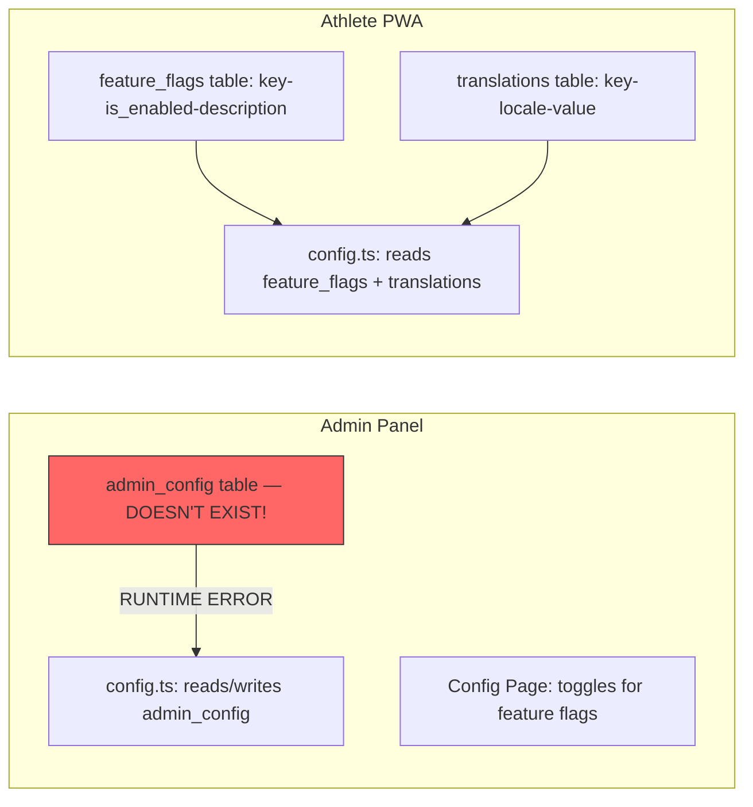

# 🔍 Gap Analysis Report: rokhdad FIT (Updated after P0 fixes)

## Executive Summary

All P0 runtime blockers have been **fixed** — original 7 schema mismatches across 16 files + 2 new critical blockers (admin_config table, Gym type columns). Remaining gaps: **3 missing admin pages**, **1 never-integrated audit system**, **1 config system disconnect**, and **13 athlete features with zero admin management**.

---

## ✅ FIXED: P0 Schema Mismatches (Previously 7 Runtime Blockers)

All 7 critical schema mismatches have been fixed:

| # | Issue | Status | Files Fixed |
|---|-------|--------|-------------|
| 1 | Booking FK: `user_id` → `athlete_id` | ✅ Fixed | types.ts, bookings.ts, analytics.ts, reports.ts |
| 2 | Booking Status: `pending/confirmed` → `upcoming/active/expired` | ✅ Fixed | types.ts, bookings.ts, analytics.ts, reports.ts, bookings/page.tsx |
| 3 | Booking Amount: `price` → `amount` | ✅ Fixed | analytics.ts, reports.ts |
| 4 | Wallet FK: `user_id` → `profile_id` | ✅ Fixed | types.ts, wallet.ts |
| 5 | Wallet Type: `credit/debit` → `top_up/session_purchase/refund/bonus` | ✅ Fixed | types.ts, wallet.ts |
| 6 | Time Slot: `day_of_week` → `date` | ✅ Fixed | types.ts, time-slots.ts |
| 7 | Role: `manager` → `gym_manager` + DB CHECK for coach/doctor | ✅ Fixed | types.ts, auth.ts, layout.tsx, admin-sidebar.tsx, role-badge.tsx, dashboard/page.tsx, analytics/page.tsx, bookings/page.tsx, reports/page.tsx, users/page.tsx + new migration |

Additionally fixed: `profiles.gym_id` → `gyms.manager_id` lookup pattern in **4 files** (bookings.ts, time-slots.ts, gyms.ts, trainers.ts).

---

## ✅ FIXED: New Critical Runtime Blockers

### 1. `admin_config` Table — ✅ Created in DB Migration

| Layer | Status | Details |
|-------|--------|---------|
| **DB Migration** | ✅ **CREATED** | [20240530000000_create_admin_config_table.sql](athlete-pwa/supabase/migrations/20240530000000_create_admin_config_table.sql) — table with `key`, `value`, `description`, RLS for admin-only |
| **Seed Data** | ✅ **INSERTED** | Default `system_config` row with JSON value for all config settings |
| **Admin config.ts** | ✅ Works | Reads/writes `admin_config` — table now exists |
| **Config Page** | ✅ Works | Calls `getSystemConfig()` — will return seeded data |

### 2. `Gym` Type Missing Required DB Columns — ✅ Fixed

The `Gym` interface now has all **18 columns** matching the DB schema exactly:

| DB Column | In Admin `Gym` Type? | Notes |
|-----------|---------------------|-------|
| `city TEXT NOT NULL` | ✅ Added | Required in form validation |
| `area TEXT` | ✅ Added | Optional in form |
| `latitude DECIMAL(10,8)` | ✅ Added | Optional, number input |
| `longitude DECIMAL(11,8)` | ✅ Added | Optional, number input |
| `price_per_session DECIMAL(10,2)` | ✅ Added | Required, defaults to 0 |
| `instagram TEXT` | ✅ Added | Optional in form |
| `avg_rating DECIMAL(3,2)` | ✅ Added | DB default 0, not in form |
| `review_count INTEGER` | ✅ Added | DB default 0, not in form |
| `open_time TIME` | ✅ Added | Time input, defaults 08:00 |
| `close_time TIME` | ✅ Added | Time input, defaults 22:00 |
| `manager_id UUID` | ✅ Added | DB nullable, not in create form |
| `is_active BOOLEAN` | ✅ Added | Toggle switch in form |

**Additional fixes**:
- Added [`CreateGymInput`](adminpanel/app/actions/types.ts:116) type — makes `avg_rating`, `review_count`, `manager_id` optional (they have DB defaults)
- Removed `email` from `Gym` type (DB `gyms` table has no `email` column)
- Added [`formDataToCreateInput()`](adminpanel/app/(dashboard)/dashboard/gyms/page.tsx:46) converter — transforms string form values to proper types (number, null) before passing to server actions
- Expanded [`updateGym`](adminpanel/app/actions/gyms.ts:249) and [`updateOwnGym`](adminpanel/app/actions/gyms.ts:65) Pick types to include all new updateable fields

---

## 🟠 HIGH: Missing Admin Pages (Dead Navigation Links)

The sidebar references pages that **do not exist** as route files:

| Sidebar Link | Route | Page File Exists? | Impact |
|-------------|-------|------------------|--------|
| مربیان (Trainers) | `/dashboard/trainers` | ❌ NO | 404 for admin+gym_manager roles |
| زمان‌بندی (Time Slots) | `/dashboard/time-slots` | ❌ NO | 404 for admin+gym_manager roles |
| پروفایل باشگاه (Gym Profile) | `/dashboard/gym-profile` | ❌ NO | 404 for gym_manager role |

Dashboard [`page.tsx`](adminpanel/app/(dashboard)/dashboard/page.tsx) redirects to non-existent paths:
- Coach → `/admin/sessions` — ❌ NO page (also wrong path prefix `/admin/` vs `/dashboard/`)
- Doctor → `/admin/health-records` — ❌ NO page (also wrong path prefix)

**Backend actions DO exist** for trainers and time-slots but have no frontend pages.

---

## 🟠 HIGH: Audit Log Never Integrated

| Component | Status | Details |
|-----------|--------|---------|
| DB Table | ✅ Exists | `audit_logs` with RLS for admin-only |
| Backend Action | ✅ Exists | [`logAuditAction()`](adminpanel/app/actions/audit-log.ts:213) |
| Frontend Page | ✅ Exists | [`audit-log/page.tsx`](adminpanel/app/(dashboard)/dashboard/audit-log/page.tsx) |
| **Integration** | ❌ **NEVER CALLED** | `logAuditAction` is never invoked from any admin action |

**Impact**: Audit log page will always show empty results. No admin actions (user role changes, gym CRUD, booking updates, wallet transactions, config changes) are being tracked.

---

## 🟠 HIGH: Config System Disconnect

**Problem**: The admin panel stores feature flags as a JSON value in `admin_config` (which doesn't even exist as a table), but the athlete PWA reads feature flags from a separate `feature_flags` table. Even if `admin_config` were created, changing a feature flag in the admin panel **would NOT affect** what the athlete PWA sees.

| Config Aspect | Admin Panel | Athlete PWA | Bridge? |
|--------------|-------------|-------------|---------|
| Feature Flags | `admin_config` JSON (broken) | `feature_flags` table rows | ❌ None |
| Translations | Not managed | `translations` table | ❌ None |
| Countries/Currency | `getCountries` reads `countries` | `getCurrencyConfigs` reads `countries` | ✅ Same table |

---

## 🟡 MEDIUM: Missing Admin Management for Athlete Features

These features exist fully in the athlete PWA but have **zero admin panel management**:

| Athlete Feature | DB Tables | Athlete Backend | Admin Backend | Admin Frontend |
|----------------|-----------|----------------|--------------|----------------|
| Workout Tracking | workout_sessions, workout_sets | ✅ workouts.ts | ❌ None | ❌ None |
| Exercises Library | exercises, exercise_translations, muscle_groups, equipment_types | ✅ workouts.ts | ❌ None | ❌ None |
| Custom Exercises | user_custom_exercises | ✅ workouts.ts | ❌ None | ❌ None |
| Routines | routines, routine_days, routine_exercises, routine_sets | ✅ routines.ts | ❌ None | ❌ None |
| Body Measurements | body_measurements | ✅ analytics.ts | ❌ None | ❌ None |
| Social Features | user_follows, workout_likes, workout_comments, shared_workouts | ✅ social.ts | ❌ None | ❌ None |
| Gym Reviews | gym_reviews | ✅ bookings.ts (rateBooking) | ❌ None | ❌ None |
| Favorite Gyms | favorite_gyms | ✅ profile.ts | ❌ None | ❌ None |
| Gym Photos | gym_photos | ✅ gyms.ts (getGymDetail) | ❌ None | ❌ None |
| Gym Amenities | gym_amenities | ✅ gyms.ts | ❌ None | ❌ None |
| Gym Sport Types | gym_sport_types | ✅ gyms.ts | ❌ None | ❌ None |
| Gym Trainers | gym_trainers | ✅ gyms.ts (getGymDetail) | Partial: trainers.ts action | ❌ No page |
| Onboarding Data | athlete_profiles | ✅ auth.ts | ❌ None | ❌ None |

---

## 🟡 MEDIUM: Auth Method Gap

| Aspect | Admin Panel | Athlete PWA |
|--------|-------------|-------------|
| Auth Method | Email + Password | Phone OTP |
| Profile Creation | Auto via Supabase trigger | Manual via service role in `completeOnboarding` |
| Email Column | Added by migration | Not used |
| Role Restriction | `allowedRoles` on login | No role restriction |

---

## 🟡 MEDIUM: Wallet deductFunds Balance Check Race Condition

[`deductFunds()`](adminpanel/app/actions/wallet.ts:350) still reads `wallet_balance` to check sufficiency before inserting the transaction. While the actual balance update is now atomic (via trigger), the sufficiency check itself is a non-atomic read that could be stale if another concurrent transaction is processed between the read and the insert.

**Risk**: If two deductions happen concurrently, both could pass the balance check but the second deduction's trigger-based update could result in a negative balance.

---

## 📊 Complete DB Table Coverage Matrix

| DB Table | Athlete PWA | Admin Panel | Gap? |
|----------|-------------|-------------|------|
| countries | ✅ Read | ✅ getCountries | ✅ OK |
| profiles | ✅ Read/Write | ✅ Read/Write | ✅ OK (after fixes) |
| athlete_profiles | ✅ Read/Write | ❌ None | ❌ Gap |
| gyms | ✅ Read | ✅ Read/Write | ⚠️ Gym type missing columns |
| gym_photos | ✅ Read | ❌ None | ❌ Gap |
| gym_amenities | ✅ Read | ❌ None | ❌ Gap |
| gym_sport_types | ✅ Read | ❌ None | ❌ Gap |
| gym_trainers | ✅ Read | Partial (action, no page) | ❌ Gap |
| gym_time_slots | ✅ Read/Write | Partial (action, no page) | ❌ Gap |
| bookings | ✅ Read/Write | ✅ Read/Write | ✅ OK (after fixes) |
| gym_reviews | ✅ Read/Write | ❌ None | ❌ Gap |
| wallet_transactions | ✅ Read/Write | ✅ Read/Write | ✅ OK (after fixes) |
| favorite_gyms | ✅ Read/Write | ❌ None | ❌ Gap |
| muscle_groups | ✅ Read | ❌ None | ❌ Gap |
| equipment_types | ✅ Read | ❌ None | ❌ Gap |
| exercises | ✅ Read | ❌ None | ❌ Gap |
| exercise_translations | ✅ Read | ❌ None | ❌ Gap |
| user_custom_exercises | ✅ Read/Write | ❌ None | ❌ Gap |
| workout_sessions | ✅ Read/Write | ❌ None | ❌ Gap |
| workout_sets | ✅ Read/Write | ❌ None | ❌ Gap |
| routines | ✅ Read/Write | ❌ None | ❌ Gap |
| routine_days | ✅ Read/Write | ❌ None | ❌ Gap |
| routine_exercises | ✅ Read/Write | ❌ None | ❌ Gap |
| routine_sets | ✅ Read/Write | ❌ None | ❌ Gap |
| body_measurements | ✅ Read/Write | ❌ None | ❌ Gap |
| user_follows | ✅ Read/Write | ❌ None | ❌ Gap |
| workout_likes | ✅ Read/Write | ❌ None | ❌ Gap |
| workout_comments | ✅ Read/Write | ❌ None | ❌ Gap |
| shared_workouts | ✅ Read/Write | ❌ None | ❌ Gap |
| audit_logs | ❌ | ✅ Read/Write (never called) | ⚠️ Never integrated |
| admin_config | ❌ | ✅ Read/Write (table doesn't exist!) | 🔴 Broken |
| translations | ✅ Read | ❌ None | ❌ Gap |
| feature_flags | ✅ Read | ❌ Uses admin_config instead | ❌ Disconnect |

---

## 🛠️ Recommended Fix Priority (Updated)

### P0 — Must Fix Before Any Admin Panel Usage (Runtime Blockers) — ✅ ALL FIXED

1. ✅ **FIXED**: All 7 original schema mismatches
2. ✅ **FIXED**: Created `admin_config` table in DB migration + seeded default config row
3. ✅ **FIXED**: Added all missing columns to `Gym` type + `CreateGymInput` type + updated gyms page form with all new fields + removed non-existent `email` column

### P1 — Must Fix for Admin Panel to Be Functional

4. **Create Missing Pages**: Build `/dashboard/trainers`, `/dashboard/time-slots`, `/dashboard/gym-profile` page files
5. **Fix Dashboard Redirects**: Change coach/doctor redirects from `/admin/...` to `/dashboard/...` paths, or create dedicated pages
6. **Integrate Audit Logging**: Call `logAuditAction()` from every admin action (users, gyms, bookings, wallet, config)
7. **Fix Wallet deductFunds Race**: Use Supabase RPC for atomic balance check + deduction, or add a DB constraint to prevent negative balances

### P2 — Should Fix for Full Admin-Athlete Feature Parity

8. **Add Exercise Management**: Admin CRUD for exercises, exercise_translations, muscle_groups, equipment_types
9. **Add Workout Session Viewing**: Admin read-only view of workout_sessions and workout_sets per user
10. **Add Routine Management**: Admin view/manage routines and routine templates
11. **Add Body Measurement Viewing**: Admin view of body_measurements per user
12. **Add Social Feature Management**: Admin view/moderation for user_follows, workout_likes, workout_comments, shared_workouts
13. **Add Gym Sub-entity Management**: Admin CRUD for gym_photos, gym_amenities, gym_sport_types within gym detail view
14. **Add Gym Review Management**: Admin view/moderation for gym_reviews
15. **Add Favorite Gym Viewing**: Admin view of favorite_gyms per user
16. **Add Onboarding Data Viewing**: Admin view of athlete_profiles data

### P3 — Should Fix for Config System Consistency

17. **Bridge Config Systems**: Make admin panel write to `feature_flags` table instead of `admin_config` JSON, so athlete PWA picks up changes
18. **Add Translation Management**: Admin CRUD for `translations` table
19. **Add Country Management**: Admin CRUD for `countries` table (currency, RTL, phone prefix)