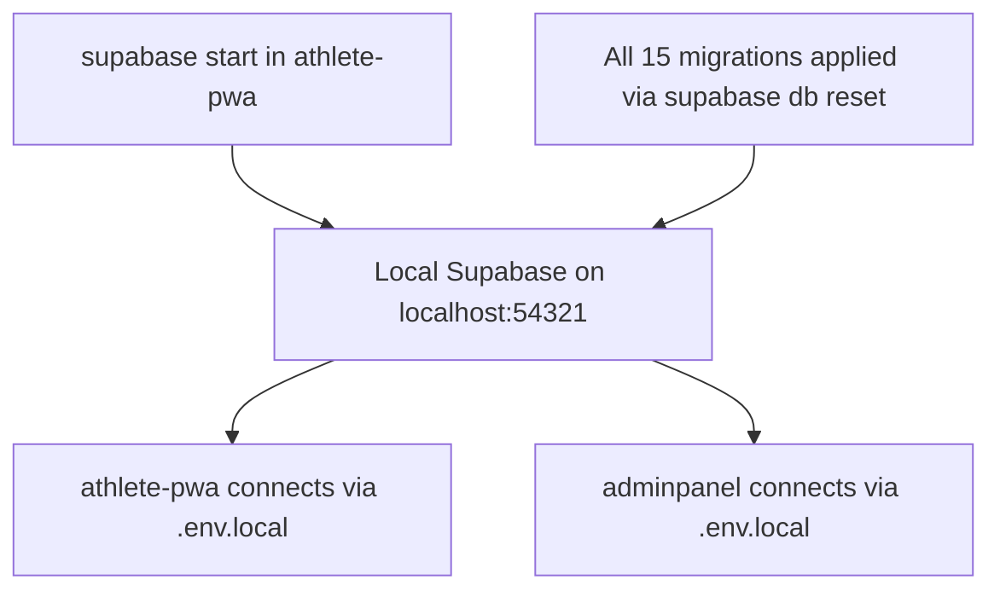
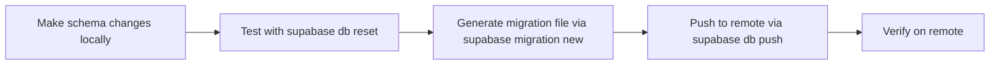

# Local Supabase Migration Plan

> **Goal**: Switch both `athlete-pwa` and `adminpanel` from the remote Supabase instance to a local Supabase instance for faster development.
> **Date**: 2026-05-22

---

## Current State

Both apps currently point to the **same remote Supabase project**:

| App | Remote URL | Config |
|-----|-----------|--------|
| `athlete-pwa` | `https://exmwnpevdwgyqjfyibir.supabase.co` | Has `supabase/config.toml`, 14 migrations |
| `adminpanel` | `https://exmwnpevdwgyqjfyibir.supabase.co` | No `config.toml`, 1 migration |

Both apps use `NEXT_PUBLIC_SUPABASE_URL` and `NEXT_PUBLIC_SUPABASE_ANON_KEY` env vars in their Supabase client code — no hardcoded URLs, which makes switching straightforward.

---

## Architecture Decision: Single Local Instance

Both apps share the **same database** on remote Supabase. They should also share the **same local instance**. The `athlete-pwa` directory is the primary Supabase project since it already has [`config.toml`](../athlete-pwa/supabase/config.toml:1) and all core migrations.



The `adminpanel` does NOT need its own `supabase init` — it simply points to the same local instance via environment variables.

---

## Step-by-Step Plan

### Step 1: Consolidate Migrations

The `adminpanel` has one migration [`20240528000000_create_admin_auth.sql`](../adminpanel/supabase/migrations/20240528000000_create_admin_auth.sql:1) that is NOT in `athlete-pwa`. Copy it into `athlete-pwa/supabase/migrations/` so all migrations are unified in one place.

- **Action**: Copy `adminpanel/supabase/migrations/20240528000000_create_admin_auth.sql` → `athlete-pwa/supabase/migrations/20240528000000_create_admin_auth.sql`
- **Reason**: `supabase db reset` reads migrations from the project with `config.toml`

### Step 2: Start Local Supabase

Run `supabase start` from the `athlete-pwa` directory. This spins up all local containers via Docker.

- **Command**: `cd athlete-pwa && supabase start`
- **Output**: Prints local credentials — API URL, anon key, service_role key, Studio URL, DB URL
- **Ports** (from [`config.toml`](../athlete-pwa/supabase/config.toml:1)):
  - API: `54321`
  - DB: `54322`
  - Studio: `54323`
  - Inbucket: `54324`

### Step 3: Create Comprehensive Seed File

Create `athlete-pwa/supabase/seed.sql` with test user accounts AND realistic data for **every feature** in the app. The Supabase CLI automatically runs this file after `supabase db reset`, so it stays separate from migrations and only populates local dev data.

> **Note**: Some tables are already seeded by migrations — countries, gyms, gym photos/amenities/sport_types/trainers/time_slots, muscle_groups, equipment_types, exercises + translations, feature_flags, translations, and the admin auth user. The `seed.sql` only adds data that migrations don't cover.

**Test accounts to seed:**

| Account | Phone/Email | Password | Role | Purpose |
|---------|-------------|----------|------|---------|
| Admin | `admin@rokhdad.fit` | `Admin123!` | admin | Already in migration — seed.sql enriches profile |
| Athlete IR | `+989123456789` | — | athlete | Iranian athlete, full data across all features |
| Athlete AE | `+971501234567` | — | athlete | UAE athlete, cross-country testing |
| Gym Manager | `manager@rokhdad.fit` | `Manager123!` | gym_manager | Manager with gym assignment |

**Complete seed data by feature area:**

#### 🏋️ Workout Tracking
| Table | What Gets Seeded |
|-------|-----------------|
| `workout_sessions` | 2 completed + 1 in-progress per athlete IR, 1 completed for athlete AE |
| `workout_exercises` | 3-4 exercises per session referencing seeded exercises from migration `20240525000000` |
| `workout_sets` | 3-4 sets per exercise with weight/reps/RPE data |
| `exercise_progress` | PR records for bench press, squat, deadlift per athlete |

#### 📋 Routines
| Table | What Gets Seeded |
|-------|-----------------|
| `routines` | 2 routines per athlete: Push/Pull/Legs + Full Body |
| `routine_days` | 3 days for PPL routine, 1 day for Full Body |
| `routine_exercises` | 3-4 exercises per routine day |
| `routine_sets` | 3-4 planned sets per routine exercise |

#### 💰 Wallet & Bookings
| Table | What Gets Seeded |
|-------|-----------------|
| `wallet_transactions` | 2 top-ups + session purchases per athlete |
| `bookings` | 2 completed + 1 upcoming per athlete |
| `gym_reviews` | 1 review per completed booking |
| `favorite_gyms` | 2 favorite gyms per athlete |
| `gyms.manager_id` | Update first gym to point to gym_manager |

#### 📏 Body Stats
| Table | What Gets Seeded |
|-------|-----------------|
| `body_measurements` | 3 measurements over past 3 weeks per athlete IR showing progress |
| `athlete_profiles` | Update with height, weight, sport_preferences, fitness_level, gender |

#### 👥 Social
| Table | What Gets Seeded |
|-------|-----------------|
| `user_follows` | Athlete IR follows Athlete AE, Athlete AE follows Athlete IR |
| `workout_likes` | Athlete AE likes Athlete IRs shared workout |
| `workout_comments` | 1-2 comments on shared workouts |
| `profiles` columns | Update bio, follower_count, following_count, workout_count, is_public |

#### 🔒 Admin / Audit
| Table | What Gets Seeded |
|-------|-----------------|
| `audit_logs` | 5-10 admin action logs for admin panel testing |

**How it works:**
1. Insert users into `auth.users` with `crypt()` for password hashing
2. Auth triggers auto-create `profiles` + `athlete_profiles` rows
3. `seed.sql` then **updates** auto-created profiles with enriched data
4. Seeds all feature tables in dependency order respecting FK constraints
5. References existing seeded data from migrations: gym IDs, exercise IDs, time slot IDs

**Dependency order for seed.sql:**
```
auth.users → profiles → athlete_profiles → gyms.manager_id
→ wallet_transactions → gym_time_slots → bookings → gym_reviews
→ favorite_gyms → workout_sessions → workout_exercises → workout_sets
→ exercise_progress → routines → routine_days → routine_exercises → routine_sets
→ body_measurements → user_follows → workout_likes → workout_comments → audit_logs
```

**Why seed.sql instead of a migration:**
- Migrations are for schema changes — they run on both local AND remote
- Seed data is dev-only — it should NEVER be pushed to production
- `seed.sql` runs automatically on `supabase db reset` but is ignored by `supabase db push`

### Step 4: Apply All Migrations + Seed Data to Local DB

Run `supabase db reset` to apply all 15 migrations in order, then automatically run `seed.sql`.

- **Command**: `cd athlete-pwa && supabase db reset`
- **This applies**: All migrations from `20240515000000` through `20240528000000` including gym seed data, then `seed.sql` for test users
- **Result**: Local DB has the same schema as remote, plus seed data for gyms, exercises, AND test user accounts

### Step 5: Update Environment Variables

#### athlete-pwa `.env.local`

Replace remote credentials with local ones. The local Supabase provides these values after `supabase start`:

```env
# Local Supabase
NEXT_PUBLIC_SUPABASE_URL=http://localhost:54321
NEXT_PUBLIC_SUPABASE_ANON_KEY=<local_anon_key_from_supabase_start>
SUPABASE_SERVICE_ROLE_KEY=<local_service_role_key_from_supabase_start>

NEXT_PUBLIC_SUPABASE_PUBLISHABLE_KEY=  # Not needed for local

# Dev OTP bypass — works with local auth too
DEV_OTP=123456
```

#### adminpanel `.env.local`

Same local credentials:

```env
# Local Supabase — same instance as athlete-pwa
NEXT_PUBLIC_SUPABASE_URL=http://localhost:54321
NEXT_PUBLIC_SUPABASE_ANON_KEY=<local_anon_key_from_supabase_start>
SUPABASE_SERVICE_ROLE_KEY=<local_service_role_key_from_supabase_start>
```

### Step 6: Save Remote Credentials for Easy Switching

Create `.env.remote` files in both apps to preserve remote credentials. This makes it trivial to switch back to remote when needed.

- **athlete-pwa `.env.remote`**: Store the current remote URL, anon key, service_role key, publishable key, DEV_OTP
- **adminpanel `.env.remote`**: Store the current remote URL, anon key, service_role key
- **Add both `.env.remote` files to `.gitignore`** — they contain secrets

### Step 7: Verify athlete-pwa Connection

- Restart the dev server: `cd athlete-pwa && npm run dev`
- Open `http://localhost:3000` and test:
  - Landing page loads without errors
  - Login page renders
  - Auth flow works with DEV_OTP bypass
  - Home page loads with data from local seed migrations

### Step 8: Verify adminpanel Connection

- Start adminpanel dev server: `cd adminpanel && npm run dev`
- Open adminpanel URL and test:
  - Login page renders
  - Dashboard loads after auth
  - Data queries work against local DB

### Step 9: Test Auth Flow with Local Inbucket

Local Supabase includes **Inbucket** on port `54324` for email testing. Verify:

- OTP emails are captured by Inbucket — view at `http://localhost:54324`
- DEV_OTP bypass still works for faster testing
- Auth triggers from [`20240518000000_create_auth_trigger.sql`](../athlete-pwa/supabase/migrations/20240518000000_create_auth_trigger.sql:1) and [`20240519000000_fix_auth_trigger_conflict.sql`](../athlete-pwa/supabase/migrations/20240519000000_fix_auth_trigger_conflict.sql:1) fire correctly on local

### Step 10: Create Developer Workflow Guide

Add a section to [`AGENTS.md`](../athlete-pwa/AGENTS.md:1) or create a standalone guide covering:

- How to start/stop local Supabase
- How to reset the local DB when schema changes
- How to switch between local and remote environments
- How to view captured emails in Inbucket
- How to create new migrations locally and push to remote when ready

---

## Key Considerations

### Auth Differences: Local vs Remote

| Feature | Remote | Local |
|---------|--------|-------|
| SMS OTP | Real SMS via provider | Not available — use DEV_OTP bypass or Inbucket email |
| Email OTP | Real email | Captured by Inbucket at localhost:54324 |
| OAuth providers | Configured | Not configured by default — needs `config.toml` setup |
| JWT signing | Remote secret | Local secret — different from remote |

### Data Isolation

- Local DB starts **empty** except for seed data in migrations and `seed.sql`
- Test user accounts are auto-created by `seed.sql` on every `supabase db reset`
- No production user accounts exist locally — fully isolated from remote
- The admin user from [`20240523000000_create_admin_user.sql`](../athlete-pwa/supabase/migrations/20240523000000_create_admin_user.sql:1) is created as part of migrations, then enhanced by `seed.sql`

### Migration Workflow



### Storage Buckets

If any storage buckets exist on remote, they need to be manually created on local since migrations don't cover storage configuration. Check remote buckets and add them to [`config.toml`](../athlete-pwa/supabase/config.toml:68) if needed.

---

## Files to Modify

| File | Change |
|------|--------|
| `athlete-pwa/.env.local` | Replace remote URL/keys with local |
| `adminpanel/.env.local` | Replace remote URL/keys with local |
| `athlete-pwa/.env.remote` | **New** — store remote credentials |
| `adminpanel/.env.remote` | **New** — store remote credentials |
| `athlete-pwa/.gitignore` | Add `.env.remote` |
| `adminpanel/.gitignore` | Add `.env.remote` |
| `athlete-pwa/supabase/migrations/20240528000000_create_admin_auth.sql` | **New** — copied from adminpanel |
| `athlete-pwa/supabase/seed.sql` | **New** — test user accounts + enriched profile data |

**No code changes needed** — both apps already use env vars for Supabase configuration in [`server.ts`](../athlete-pwa/lib/supabase/server.ts:1), [`client.ts`](../athlete-pwa/lib/supabase/client.ts:1), and [`middleware.ts`](../athlete-pwa/lib/supabase/middleware.ts:1).

---

## Test Accounts Quick Reference

After `supabase db reset`, these accounts are available:

| Account | Login Method | Credentials | Use For |
|---------|-------------|-------------|---------|
| **Admin** | Email + Password | `admin@rokhdad.fit` / `Admin123!` | Admin panel login, RBAC testing |
| **Athlete IR** | Phone OTP | `+989123456789` / any OTP with `DEV_OTP=123456` | Athlete PWA — Iranian user, completed onboarding |
| **Athlete AE** | Phone OTP | `+971501234567` / any OTP with `DEV_OTP=123456` | Athlete PWA — UAE user, cross-country testing |
| **Gym Manager** | Email + Password | `manager@rokhdad.fit` / `Manager123!` | Admin panel — gym manager role |

---

## Quick Reference Commands

```bash
# Start local Supabase
cd athlete-pwa && supabase start

# Stop local Supabase
cd athlete-pwa && supabase stop

# Reset local DB with all migrations + seed data
cd athlete-pwa && supabase db reset

# View local Supabase status and credentials
cd athlete-pwa && supabase status

# Create a new migration after schema changes
cd athlete-pwa && supabase migration new <name>

# Push migrations to remote
cd athlete-pwa && supabase db push

# Switch to remote: copy .env.remote → .env.local
# Switch to local:  update .env.local with values from supabase status