# Optimize Dev Loading & Fix Constant Refresh Cycle

> **Status**: Plan approved — ready for implementation
> **Supabase**: Migrated to local Docker (http://127.0.0.1:54321)

## Problem Diagnosis

The app is stuck in an endless Fast Refresh cycle with 30-55 second page loads. Root cause analysis reveals **6 interconnected issues**:

### 1. Supabase Host Unreachable — PRIMARY CAUSE
`ENOTFOUND exmwnpevdwgyqjfyibir.supabase.co` — DNS cannot resolve the Supabase project URL. Every call to Supabase fails and triggers the built-in retry mechanism in `@supabase/auth-js`, causing 30+ second hangs per request.

### 2. Auth-js Retry Cascade
When Supabase is unreachable, `@supabase/auth-js` calls `retryable()` with exponential backoff. The browser client's `_emitInitialSession` → `_refreshAccessToken` loop keeps firing, causing state changes that trigger React re-renders → Next.js Fast Refresh cycles.

### 3. Middleware Blocks Every Request
[`middleware.ts`](athlete-pwa/middleware.ts) calls `supabase.auth.getUser()` on every non-static path. When Supabase is down, each page navigation waits for the full auth timeout/retry cycle before proceeding — blocking all navigation.

### 4. GlobalEngineContext Fires 5 Parallel Server Actions on Mount
[`GlobalEngineContext.tsx`](athlete-pwa/lib/GlobalEngineContext.tsx:63) fires `getAllTranslations`, `getCurrencyConfigs`, `getFeatureFlags`, `getRtlMap`, `getUserCountryId` in `Promise.all` on mount. Each creates a **separate** Supabase client and makes separate DB calls. All 5 hang for 30s when Supabase is down.

### 5. getUserCountryId is Especially Slow
[`getUserCountryId()`](athlete-pwa/app/actions/config.ts:223) calls `supabase.auth.getUser()` first — which retries — then queries profiles. Logged at **28 seconds** in terminal output.

### 6. No Timeout or Retry Configuration
Supabase clients in [`server.ts`](athlete-pwa/lib/supabase/server.ts), [`client.ts`](athlete-pwa/lib/supabase/client.ts), and [`middleware.ts`](athlete-pwa/lib/supabase/middleware.ts) have no explicit timeout or retry limits. The default `auth-js` retry behavior retries indefinitely with exponential backoff.

---

## Architecture Flow — Current vs Optimized

```mermaid
flowchart TD
    subgraph Current_Broken_Flow
        A1[Browser loads page] --> B1[Middleware: getUser - 30s timeout]
        B1 --> C1[GlobalEngineContext mount]
        C1 --> D1[5 parallel server actions - each 30s]
        D1 --> E1[Browser client: _emitInitialSession - retries]
        E1 --> F1[State change triggers Fast Refresh]
        F1 --> G1[Re-render triggers more auth calls]
        G1 --> E1
    end

    subgraph Optimized_Flow
        A2[Browser loads page] --> B2[Middleware: getUser with 5s timeout + fallback]
        B2 --> C2[GlobalEngineContext: single batched server action]
        C2 --> D2[Returns in <2s or uses fallbacks]
        D2 --> E2[Browser client: no auto-refresh on error]
        E2 --> F2[Stable page - no refresh cycle]
    end
```



---

## Optimization Plan

### Phase 1: Fix Supabase Connectivity

The Supabase project hostname `exmwnpevdwgyqjfyibir.supabase.co` is unresolvable. This must be fixed first — either the project was deleted/paused, or the URL is wrong.

- **Option A**: Switch to local Supabase via `supabase start` — already has [`supabase/config.toml`](athlete-pwa/supabase/config.toml) and migrations
- **Option B**: Fix the remote Supabase URL — verify the project exists and is active in Supabase Dashboard
- **Option C**: Use a different active Supabase project URL

### Phase 2: Add Timeout & Retry Limits to Supabase Clients

Configure explicit timeouts and retry limits on all Supabase client instances so failures are fast instead of hanging for 30+ seconds.

**Files to modify:**
- [`athlete-pwa/lib/supabase/server.ts`](athlete-pwa/lib/supabase/server.ts) — add `options.auth.autoRefreshToken`, retry config
- [`athlete-pwa/lib/supabase/client.ts`](athlete-pwa/lib/supabase/client.ts) — add `options.auth.autoRefreshToken`, retry config  
- [`athlete-pwa/lib/supabase/middleware.ts`](athlete-pwa/lib/supabase/middleware.ts) — add retry config to `createServerClient`

**Key changes:**
```typescript
// In all client creation calls, add:
{
  auth: {
    autoRefreshToken: false,  // prevent infinite refresh loops
    persistSession: false,    // server-side doesn't need persistence
    detectSessionInUrl: false,
  },
  global: {
    headers: { ... },
  },
  // For server client: limit retries
  options: {
    auth: {
      autoRefreshToken: false,
    },
  },
}
```

### Phase 3: Batch GlobalEngineContext Server Actions

Replace 5 parallel server actions with a single batched action that creates **one** Supabase client and fetches all config data in one call.

**Files to modify:**
- [`athlete-pwa/app/actions/config.ts`](athlete-pwa/app/actions/config.ts) — add `getAllConfig()` batched action
- [`athlete-pwa/lib/GlobalEngineContext.tsx`](athlete-pwa/lib/GlobalEngineContext.tsx) — call single batched action instead of 5

**New batched action:**
```typescript
export async function getAllConfig() {
  const supabase = await createClient()  // ONE client
  const { data: { user } } = await supabase.auth.getUser()
  
  // Parallel queries on same client — no auth retry per query
  const [translations, countries, flags] = await Promise.all([
    supabase.from('translations').select('locale, key, value'),
    supabase.from('countries').select('*').eq('is_active', true),
    supabase.from('feature_flags').select('*'),
  ])
  
  // Derive all config from single countries query
  return { translations, currencyConfigs, featureFlags, rtlMap, countryId }
}
```

### Phase 4: Add Middleware Timeout & Graceful Fallback

Wrap middleware auth check with a timeout so it doesn't block navigation when Supabase is slow/down.

**Files to modify:**
- [`athlete-pwa/lib/supabase/middleware.ts`](athlete-pwa/lib/supabase/middleware.ts) — add timeout wrapper, graceful fallback

**Key changes:**
```typescript
// Timeout wrapper for getUser
async function getUserWithTimeout(supabase, ms = 5000) {
  return Promise.race([
    supabase.auth.getUser(),
    new Promise((_, reject) => 
      setTimeout(() => reject(new Error('Auth timeout')), ms)
    ),
  ])
}

// On timeout: allow page load, skip auth redirect
// The page itself will handle auth via its own server actions
```

### Phase 5: Prevent Browser Auth Refresh Loop

Configure the browser Supabase client to not auto-refresh session on error, preventing the Fast Refresh cascade.

**Files to modify:**
- [`athlete-pwa/lib/supabase/client.ts`](athlete-pwa/lib/supabase/client.ts) — disable auto-refresh on error
- [`athlete-pwa/lib/GlobalEngineContext.tsx`](athlete-pwa/lib/GlobalEngineContext.tsx) — add AbortController or timeout to useEffect fetch

### Phase 6: Add next.config.ts Optimizations

Add Turbopack for faster dev builds and other Next.js dev optimizations.

**Files to modify:**
- [`athlete-pwa/next.config.ts`](athlete-pwa/next.config.ts) — enable Turbopack

---

## Expected Results After Optimization

| Metric | Before | After |
|--------|--------|-------|
| Page load when Supabase down | 30-55s, infinite refresh | <2s, fallback data shown |
| Page load when Supabase up | 5-15s | <2s |
| Fast Refresh cycles | Continuous | None |
| Middleware auth check | 30s timeout | 5s timeout with fallback |
| Config data fetch | 5 separate calls | 1 batched call |

---

### Phase 7: Optimize Component Rendering

Reduce unnecessary re-renders and improve rendering performance.

**Files to modify:**
- [`athlete-pwa/components/layout/bottom-tab-nav.tsx`](athlete-pwa/components/layout/bottom-tab-nav.tsx) — wrap with `React.memo`
- [`athlete-pwa/app/(athlete)/layout.tsx`](athlete-pwa/app/(athlete)/layout.tsx) — memoize pathname-dependent rendering
- [`athlete-pwa/app/(athlete)/home/page.tsx`](athlete-pwa/app/(athlete)/home/page.tsx) — lazy load heavy sub-components
- [`athlete-pwa/app/(athlete)/explore/page.tsx`](athlete-pwa/app/(athlete)/explore/page.tsx) — lazy load gym cards
- [`athlete-pwa/app/(athlete)/explore/[id]/page.tsx`](athlete-pwa/app/(athlete)/explore/[id]/page.tsx) — code split gym detail

**Key changes:**
- Wrap frequently-rendered but rarely-changing components with `React.memo()`
- Add proper `key` props to all list renders (fixes the "Encountered two children with the same key" warning)
- Use `next/dynamic` with `ssr: false` for heavy client-only components
- Code-split large page components using `next/dynamic`

### Phase 8: Load Fonts Locally

Replace Google Fonts CDN downloads with self-hosted font files to eliminate network dependency and speed up initial render.

**Files to modify:**
- [`athlete-pwa/app/layout.tsx`](athlete-pwa/app/layout.tsx) — replace `next/font/google` with local font loading
- Add font files to `athlete-pwa/public/fonts/` directory

**Key changes:**
- Download Vazirmatn, Geist, and Geist_Mono font files
- Use `next/font/local` instead of `next/font/google`
- This eliminates the external network request that blocks initial render

### Phase 9: Enable Compression & Limit Watched Files in Dev

**Files to modify:**
- [`athlete-pwa/next.config.ts`](athlete-pwa/next.config.ts) — add compression, Turbopack, and optimize config

**Key changes:**
```typescript
const nextConfig: NextConfig = {
  compress: true,           // Enable gzip compression
  experimental: {
    turbo: {                 // Enable Turbopack for faster dev builds
      rules: {},
    },
  },
  // Limit watched files to reduce dev server CPU usage
  onDemandEntries: {
    maxInactiveAge: 60 * 1000,    // 60s before evicting inactive pages
    pagesBufferLength: 2,          // Only keep 2 pages warm
  },
};
```

---

## Updated Expected Results

| Metric | Before | After |
|--------|--------|-------|
| Page load when Supabase down | 30-55s, infinite refresh | <2s, fallback data shown |
| Page load when Supabase up (local) | 5-15s | <1s |
| Fast Refresh cycles | Continuous | None |
| Middleware auth check | 30s timeout | 5s timeout with fallback |
| Config data fetch | 5 separate calls | 1 batched call |
| Font loading | External CDN download | Local, instant |
| Component re-renders | Excessive | Minimal via memo/lazy |
| Dev build speed | Slow webpack | Fast Turbopack |