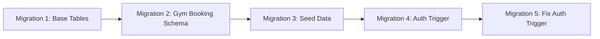
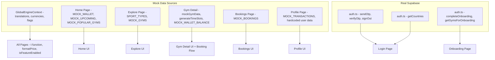

# Supabase Migration Strategy — rokhdad_FIT athlete-pwa

> **Document Purpose**: Comprehensive analysis and migration plan for replacing all mock data with live Supabase queries.
> **Methodology**: Baby Steps™ — smallest possible meaningful changes, one at a time.
> **Date**: 2026-05-17

---

## Table of Contents

1. [Current State Assessment](#1-current-state-assessment)
2. [Mock Data Inventory](#2-mock-data-inventory)
3. [Database Schema Analysis](#3-database-schema-analysis)
4. [Data Flow Mapping](#4-data-flow-mapping)
5. [Migration Phases](#5-migration-phases)
6. [File-by-File Migration Plan](#6-file-by-file-migration-plan)
7. [Risk Assessment](#7-risk-assessment)
8. [Known Bugs Found During Analysis](#8-known-bugs-found-during-analysis)

---

## 1. Current State Assessment

### What is Already Connected to Supabase ✅

| Feature | Files Involved | Status |
|---------|---------------|--------|
| **Auth: Send OTP** | [`auth.ts`](../athlete-pwa/app/actions/auth.ts:172) → `sendOtp()` | Production-ready with DEV mode bypass |
| **Auth: Verify OTP** | [`auth.ts`](../athlete-pwa/app/actions/auth.ts:202) → `verifyOtp()` | Full user creation + session management |
| **Auth: Sign Out** | [`auth.ts`](../athlete-pwa/app/actions/auth.ts:409) → `signOut()` | Working |
| **Countries** | [`auth.ts`](../athlete-pwa/app/actions/auth.ts:416) → `getCountries()` | Reads from `countries` table |
| **Onboarding** | [`auth.ts`](../athlete-pwa/app/actions/auth.ts:429) → `completeOnboarding()` | Updates `profiles` + `athlete_profiles` + `favorite_gyms` |
| **Gym List for Onboarding** | [`auth.ts`](../athlete-pwa/app/actions/auth.ts:550) → `getGymsForOnboarding()` | Reads from `gyms` table |
| **Session Middleware** | [`middleware.ts`](../athlete-pwa/lib/supabase/middleware.ts:1) | Refreshes session, protects routes, checks onboarding |
| **Supabase Browser Client** | [`client.ts`](../athlete-pwa/lib/supabase/client.ts:1) | `createBrowserClient` via `@supabase/ssr` |
| **Supabase Server Client** | [`server.ts`](../athlete-pwa/lib/supabase/server.ts:1) | `createServerClient` with cookie handling |
| **DB Triggers** | Migrations 4 & 5 | Auto-create `profiles` + `athlete_profiles` on user signup |

### What Still Uses Mock Data ❌

| Page | Mock Data | Priority |
|------|-----------|----------|
| **Home** | Wallet balance, upcoming session, popular gyms | HIGH |
| **Explore** | Sport types list, gym listings with filters | HIGH |
| **Gym Detail** | Full gym data, time slots, reviews, trainers, booking flow | CRITICAL |
| **Bookings** | Booking list with cancel/rate actions | HIGH |
| **Profile** | User info, wallet, transactions, top-up flow | MEDIUM |
| **GlobalEngineContext** | Translations, currencies, feature flags, RTL config | LOW |

---

## 2. Mock Data Inventory

### 2.1 GlobalEngineContext.tsx (758 lines)

**File**: [`GlobalEngineContext.tsx`](../athlete-pwa/lib/GlobalEngineContext.tsx:1)

| Mock Data | Lines | Description | Migration Decision |
|-----------|-------|-------------|-------------------|
| `translations` | 39-463 | ~250 keys in en/fa | Keep client-side for now; i18n is a separate concern |
| `currencyConfigs` | 466-501 | 4 countries with currency code/symbol/locale/price formatting | Could come from `countries` table, but low priority |
| `initialFeatureFlags` | 504-508 | wallet:true, social_feed:false, premium_coaching:false | Could come from a `feature_flags` table; low priority |
| `is_rtl` map | 511-514 | IR→true, AE→true, US→false, TR→false | Already in `countries.is_rtl` column |

### 2.2 Home Page

**File**: [`home/page.tsx`](../athlete-pwa/app/(athlete)/home/page.tsx:1)

| Mock Constant | Lines | Data Shape | DB Table Source |
|---------------|-------|------------|-----------------|
| `MOCK_WALLET` | ~15 | `{ balance: 450000 }` | `wallet_transactions` → computed balance |
| `MOCK_UPCOMING` | ~20 | Single session: gymName, time, sport | `bookings` WHERE status=upcoming + `gyms` |
| `MOCK_POPULAR_GYMS` | ~30 | Array of 4: id, name, rating, reviews, distance, price, sport | `gyms` ORDER BY avg_rating |

### 2.3 Explore Page

**File**: [`explore/page.tsx`](../athlete-pwa/app/(athlete)/explore/page.tsx:1)

| Mock Constant | Lines | Data Shape | DB Table Source |
|---------------|-------|------------|-----------------|
| `SPORT_TYPES` | ~15 | 6 sport types with en/fa labels | `gym_sport_types` distinct values or a dedicated `sport_types` table |
| `MOCK_GYMS` | ~50 | Array of 6 gyms with full details | `gyms` + `gym_sport_types` + `gym_amenities` |

### 2.4 Gym Detail Page

**File**: [`explore/[id]/page.tsx`](../athlete-pwa/app/(athlete)/explore/[id]/page.tsx:1)

| Mock Constant | Lines | Data Shape | DB Table Source |
|---------------|-------|------------|-----------------|
| `mockGymData` | ~100 | 2 gyms: name, rating, price, description, address, trainers, reviews, amenities, hours | `gyms` + `gym_trainers` + `gym_reviews` + `gym_amenities` + `gym_photos` |
| `generateTimeSlots()` | ~20 | 12 time slots with capacity/booked | `gym_time_slots` |
| `MOCK_WALLET_BALANCE` | 1 line | `5000000` | `wallet_transactions` → computed balance |
| Booking flow | ~200 | Summary → Processing → Success/Insufficient | `bookings` INSERT + `wallet_transactions` INSERT |

### 2.5 Bookings Page

**File**: [`bookings/page.tsx`](../athlete-pwa/app/(athlete)/bookings/page.tsx:1)

| Mock Constant | Lines | Data Shape | DB Table Source |
|---------------|-------|------------|-----------------|
| `MOCK_BOOKINGS` | ~80 | 6 bookings: 3 upcoming, 2 completed, 1 cancelled | `bookings` + `gyms` |
| Cancel action | Local state | `setTimeout` mock | `bookings` UPDATE status=cancelled |
| Rate action | Local state | `setTimeout` mock | `gym_reviews` INSERT |

### 2.6 Profile Page

**File**: [`profile/page.tsx`](../athlete-pwa/app/(athlete)/profile/page.tsx:1)

| Mock Constant | Lines | Data Shape | DB Table Source |
|---------------|-------|------------|-----------------|
| `MOCK_TRANSACTIONS` | ~10 | 5 transactions: 3 payments, 2 deposits | `wallet_transactions` |
| `walletBalance` | 1 line | `5000000` | `wallet_transactions` → computed balance |
| `totalSessions` | 1 line | `12` | `bookings` COUNT WHERE status=completed |
| `memberSince` | 1 line | `"2026-01"` | `profiles.created_at` |
| `userName` | 1 line | `"Alireza"` | `profiles.full_name` |
| Top-up flow | ~30 | `setTimeout` mock | `wallet_transactions` INSERT type=deposit |

### 2.7 Login Page (Static Maps)

**File**: [`login/page.tsx`](../athlete-pwa/app/login/page.tsx:1)

| Mock Constant | Lines | Migration Decision |
|---------------|-------|--------------------|
| `PHONE_PREFIX` | 31-36 | Could come from `countries` table; low priority |
| `COUNTRY_LOCALE_MAP` | 56-61 | Could come from `countries` table; low priority |

---

## 3. Database Schema Analysis

### 3.1 Existing Migrations



| Migration | File | Tables Created |
|-----------|------|----------------|
| `20240515000000` | [`create_base_tables.sql`](../athlete-pwa/supabase/migrations/20240515000000_create_base_tables.sql:1) | `countries`, `profiles`, `athlete_profiles` |
| `20240516000000` | [`create_gym_booking_schema.sql`](../athlete-pwa/supabase/migrations/20240516000000_create_gym_booking_schema.sql:1) | `gyms`, `gym_photos`, `gym_amenities`, `gym_sport_types`, `gym_trainers`, `gym_time_slots`, `bookings`, `gym_reviews`, `wallet_transactions`, `favorite_gyms` |
| `20240517000000` | [`seed_gym_data.sql`](../athlete-pwa/supabase/migrations/20240517000000_seed_gym_data.sql:1) | Seed data for gyms, amenities, sport types, trainers, time slots |
| `20240518000000` | [`create_auth_trigger.sql`](../athlete-pwa/supabase/migrations/20240518000000_create_auth_trigger.sql:1) | Auto-create `profiles` + `athlete_profiles` on `auth.users` insert |
| `20240519000000` | [`fix_auth_trigger_conflict.sql`](../athlete-pwa/supabase/migrations/20240519000000_fix_auth_trigger_conflict.sql:1) | Fix column name mismatch, add `ON CONFLICT DO NOTHING` |

### 3.2 Schema Coverage Analysis

The existing schema is **remarkably complete** for the current feature set:

| Domain Entity | Table(s) | RLS | Triggers | Status |
|---------------|----------|-----|----------|--------|
| Countries | `countries` | ✅ | auto-update `updated_at` | ✅ Complete |
| User Profiles | `profiles` | ✅ | auto-create from auth | ✅ Complete |
| Athlete Profiles | `athlete_profiles` | ✅ | auto-create from profiles | ✅ Complete |
| Gyms | `gyms` | ✅ | auto-update `updated_at` | ✅ Complete |
| Gym Photos | `gym_photos` | ✅ | — | ✅ Complete |
| Gym Amenities | `gym_amenities` | ✅ | — | ✅ Complete |
| Gym Sport Types | `gym_sport_types` | ✅ | — | ✅ Complete |
| Gym Trainers | `gym_trainers` | ✅ | — | ✅ Complete |
| Time Slots | `gym_time_slots` | ✅ | update availability on booking | ✅ Complete |
| Bookings | `bookings` | ✅ | — | ✅ Complete |
| Reviews | `gym_reviews` | ✅ | update gym avg_rating | ✅ Complete |
| Wallet | `wallet_transactions` | ✅ | update profile wallet_balance | ✅ Complete |
| Favorites | `favorite_gyms` | ✅ | — | ✅ Complete |

### 3.3 Schema Gaps

| Gap | Impact | Recommendation |
|-----|--------|----------------|
| No `sport_types` master table | Explore page hardcodes sport type labels | Create a `sport_types` table OR use `gym_sport_types` distinct values |
| No `translations` table | GlobalEngineContext has ~250 hardcoded translation keys | Keep client-side for now; i18n migration is a separate project |
| No `feature_flags` table | 3 hardcoded feature flags | Keep client-side; add DB table when admin panel is built |
| No `countries.phone_prefix` column | Login page hardcodes phone prefixes | Add `phone_prefix` column to `countries` table |
| No `countries.locale` column | Login page hardcodes country→locale mapping | Add `default_locale` column to `countries` table |

---

## 4. Data Flow Mapping

### 4.1 Current Data Flow (Mock)



### 4.2 Target Data Flow (Supabase)

```mermaid
flowchart TD
    subgraph Server Actions - New
        SA_GYMS[getGyms - explore listing]
        SA_GYM_DETAIL[getGymDetail - full gym data]
        SA_TIMESLOTS[getTimeSlots - available slots]
        SA_BOOKINGS[getBookings - user bookings]
        SA_CREATE_BOOKING[createBooking - book a session]
        SA_CANCEL_BOOKING[cancelBooking - cancel session]
        SA_WALLET[getWalletBalance - computed balance]
        SA_TRANSACTIONS[getTransactions - wallet history]
        SA_TOP_UP[topUpWallet - deposit funds]
        SA_PROFILE[getProfile - user info]
        SA_UPDATE_PROFILE[updateProfile - edit name]
        SA_REVIEW[submitReview - rate gym]
        SA_FAVORITES[getFavoriteGyms - user favorites]
    end

    subgraph Existing Server Actions
        AUTH[sendOtp, verifyOtp, signOut]
        ONBOARD[completeOnboarding, getGymsForOnboarding]
        COUNTRIES[getCountries]
    end

    subgraph Supabase Database
        DB_PROFILES[profiles]
        DB_ATHLETE[athlete_profiles]
        DB_GYMS[gyms]
        DB_GYM_DETAIL[gym_photos + gym_amenities + gym_sport_types + gym_trainers]
        DB_SLOTS[gym_time_slots]
        DB_BOOKINGS[bookings]
        DB_REVIEWS[gym_reviews]
        DB_WALLET[wallet_transactions]
        DB_FAVS[favorite_gyms]
        DB_COUNTRIES[countries]
    end

    SA_GYMS --> DB_GYMS
    SA_GYM_DETAIL --> DB_GYMS
    SA_GYM_DETAIL --> DB_GYM_DETAIL
    SA_TIMESLOTS --> DB_SLOTS
    SA_BOOKINGS --> DB_BOOKINGS
    SA_CREATE_BOOKING --> DB_BOOKINGS
    SA_CREATE_BOOKING --> DB_WALLET
    SA_CANCEL_BOOKING --> DB_BOOKINGS
    SA_WALLET --> DB_WALLET
    SA_TRANSACTIONS --> DB_WALLET
    SA_TOP_UP --> DB_WALLET
    SA_PROFILE --> DB_PROFILES
    SA_UPDATE_PROFILE --> DB_PROFILES
    SA_REVIEW --> DB_REVIEWS
    SA_FAVORITES --> DB_FAVS
    AUTH --> DB_PROFILES
    ONBOARD --> DB_ATHLETE
    COUNTRIES --> DB_COUNTRIES
```



---

## 5. Migration Phases

Following Baby Steps™ methodology: each phase is the smallest possible meaningful change that can be validated independently.

### Phase 0: Prerequisites (Schema Additions)

**Goal**: Add missing columns to support migration without breaking existing functionality.

| Step | Action | Files Changed |
|------|--------|---------------|
| 0.1 | Create migration: Add `phone_prefix` and `default_locale` columns to `countries` table | New: `supabase/migrations/20240520000000_add_country_fields.sql` |
| 0.2 | Seed the new columns for existing countries (IR, AE, US, TR) | Same migration file |
| 0.3 | Verify migration applies cleanly via `supabase db reset` | None |

### Phase 1: Profile Data (Simplest Read Path)

**Goal**: Replace hardcoded user data on Profile page with real Supabase queries.

**Why first**: Simplest read-only migration with no complex joins. Validates the server action → Supabase → UI pattern.

| Step | Action | Files Changed |
|------|--------|---------------|
| 1.1 | Create `getProfile()` server action in `app/actions/profile.ts` | New: `app/actions/profile.ts` |
| 1.2 | Replace hardcoded `userName`, `memberSince` in Profile page with `getProfile()` data | `app/(athlete)/profile/page.tsx` |
| 1.3 | Replace hardcoded `totalSessions` with COUNT from `bookings` table | `app/(athlete)/profile/page.tsx` |
| 1.4 | Validate: Profile page shows real user data from Supabase | Manual testing |

### Phase 2: Wallet & Transactions (Read + Write)

**Goal**: Replace all mock wallet data with real `wallet_transactions` queries.

| Step | Action | Files Changed |
|------|--------|---------------|
| 2.1 | Create `getWalletBalance()` server action | `app/actions/profile.ts` or new `app/actions/wallet.ts` |
| 2.2 | Create `getTransactions()` server action | Same file |
| 2.3 | Replace `MOCK_TRANSACTIONS` in Profile page with `getTransactions()` | `app/(athlete)/profile/page.tsx` |
| 2.4 | Replace hardcoded `walletBalance` in Profile page with `getWalletBalance()` | `app/(athlete)/profile/page.tsx` |
| 2.5 | Create `topUpWallet()` server action (INSERT into `wallet_transactions`) | Same file |
| 2.6 | Replace mock top-up flow in Profile page with real `topUpWallet()` call | `app/(athlete)/profile/page.tsx` |
| 2.7 | Replace `MOCK_WALLET_BALANCE` in Gym Detail page with `getWalletBalance()` | `app/(athlete)/explore/[id]/page.tsx` |
| 2.8 | Replace `MOCK_WALLET` in Home page with `getWalletBalance()` | `app/(athlete)/home/page.tsx` |
| 2.9 | Validate: Wallet balance, transactions, and top-up all work end-to-end | Manual testing |

### Phase 3: Gym Listing (Explore Page)

**Goal**: Replace mock gym data on Explore page with real Supabase queries.

| Step | Action | Files Changed |
|------|--------|---------------|
| 3.1 | Create `getGyms()` server action with filtering/sorting support | New: `app/actions/gyms.ts` |
| 3.2 | Create `getSportTypes()` server action (distinct sport types from `gym_sport_types`) | Same file |
| 3.3 | Replace `SPORT_TYPES` in Explore page with `getSportTypes()` | `app/(athlete)/explore/page.tsx` |
| 3.4 | Replace `MOCK_GYMS` in Explore page with `getGyms()` | `app/(athlete)/explore/page.tsx` |
| 3.5 | Replace `MOCK_POPULAR_GYMS` in Home page with `getGyms()` ordered by rating | `app/(athlete)/home/page.tsx` |
| 3.6 | Validate: Explore page shows real gyms with working filters | Manual testing |

### Phase 4: Gym Detail & Booking (Most Complex)

**Goal**: Replace mock gym detail data and implement real booking flow.

| Step | Action | Files Changed |
|------|--------|---------------|
| 4.1 | Create `getGymDetail()` server action (joins gyms + photos + amenities + sport_types + trainers) | `app/actions/gyms.ts` |
| 4.2 | Create `getGymTimeSlots()` server action | Same file |
| 4.3 | Create `getGymReviews()` server action | Same file |
| 4.4 | Replace `mockGymData` in Gym Detail page with `getGymDetail()` | `app/(athlete)/explore/[id]/page.tsx` |
| 4.5 | Replace `generateTimeSlots()` with `getGymTimeSlots()` | `app/(athlete)/explore/[id]/page.tsx` |
| 4.6 | Create `createBooking()` server action (INSERT booking + INSERT wallet_transaction + UPDATE time_slot) | `app/actions/bookings.ts` |
| 4.7 | Replace mock booking flow with real `createBooking()` call | `app/(athlete)/explore/[id]/page.tsx` |
| 4.8 | Validate: Full booking flow works — select slot → confirm → wallet deducted → booking created | Manual testing |

### Phase 5: Bookings Management

**Goal**: Replace mock bookings list with real data and implement cancel/rate.

| Step | Action | Files Changed |
|------|--------|---------------|
| 5.1 | Create `getBookings()` server action (joins bookings + gyms) | `app/actions/bookings.ts` |
| 5.2 | Replace `MOCK_BOOKINGS` in Bookings page with `getBookings()` | `app/(athlete)/bookings/page.tsx` |
| 5.3 | Create `cancelBooking()` server action | `app/actions/bookings.ts` |
| 5.4 | Replace mock cancel with real `cancelBooking()` + wallet refund | `app/(athlete)/bookings/page.tsx` |
| 5.5 | Create `submitReview()` server action | `app/actions/bookings.ts` or `app/actions/reviews.ts` |
| 5.6 | Replace mock rate with real `submitReview()` | `app/(athlete)/bookings/page.tsx` |
| 5.7 | Replace `MOCK_UPCOMING` in Home page with real upcoming bookings | `app/(athlete)/home/page.tsx` |
| 5.8 | Validate: Full booking lifecycle — browse → book → view → cancel/rate | Manual testing |

### Phase 6: Cleanup & Polish

**Goal**: Remove all remaining mock data references and clean up.

| Step | Action | Files Changed |
|------|--------|---------------|
| 6.1 | Remove `PHONE_PREFIX` and `COUNTRY_LOCALE_MAP` from Login page; use `countries` table data | `app/login/page.tsx` |
| 6.2 | Move `currencyConfigs` from GlobalEngineContext to use `countries` table data | `lib/GlobalEngineContext.tsx` |
| 6.3 | Move `is_rtl` map from GlobalEngineContext to use `countries.is_rtl` | `lib/GlobalEngineContext.tsx` |
| 6.4 | Remove Dynamic Layout Engine mock components from GlobalEngineContext if unused | `lib/GlobalEngineContext.tsx` |
| 6.5 | Fix duplicate `handleLogout` bug in Profile page | `app/(athlete)/profile/page.tsx` |
| 6.6 | Final validation: Complete user journey test | Manual testing |

---

## 6. File-by-File Migration Plan

### New Files to Create

| File | Purpose | Phase |
|------|---------|-------|
| `athlete-pwa/app/actions/profile.ts` | `getProfile()`, `updateProfile()` | Phase 1 |
| `athlete-pwa/app/actions/wallet.ts` | `getWalletBalance()`, `getTransactions()`, `topUpWallet()` | Phase 2 |
| `athlete-pwa/app/actions/gyms.ts` | `getGyms()`, `getSportTypes()`, `getGymDetail()`, `getGymTimeSlots()`, `getGymReviews()` | Phases 3-4 |
| `athlete-pwa/app/actions/bookings.ts` | `getBookings()`, `createBooking()`, `cancelBooking()`, `submitReview()` | Phases 4-5 |
| `athlete-pwa/supabase/migrations/20240520000000_add_country_fields.sql` | Add `phone_prefix`, `default_locale` to countries | Phase 0 |

### Existing Files to Modify

| File | Changes | Phase |
|------|---------|-------|
| [`home/page.tsx`](../athlete-pwa/app/(athlete)/home/page.tsx:1) | Remove `MOCK_WALLET`, `MOCK_UPCOMING`, `MOCK_POPULAR_GYMS`; add server action calls | 2, 3, 5 |
| [`explore/page.tsx`](../athlete-pwa/app/(athlete)/explore/page.tsx:1) | Remove `SPORT_TYPES`, `MOCK_GYMS`; add server action calls | 3 |
| [`explore/[id]/page.tsx`](../athlete-pwa/app/(athlete)/explore/[id]/page.tsx:1) | Remove `mockGymData`, `generateTimeSlots()`, `MOCK_WALLET_BALANCE`; add server action calls + real booking | 2, 4 |
| [`bookings/page.tsx`](../athlete-pwa/app/(athlete)/bookings/page.tsx:1) | Remove `MOCK_BOOKINGS`; add server action calls for list/cancel/rate | 5 |
| [`profile/page.tsx`](../athlete-pwa/app/(athlete)/profile/page.tsx:1) | Remove `MOCK_TRANSACTIONS`, hardcoded user data; add server action calls; fix duplicate `handleLogout` | 1, 2, 6 |
| [`login/page.tsx`](../athlete-pwa/app/login/page.tsx:1) | Remove `PHONE_PREFIX`, `COUNTRY_LOCALE_MAP`; use countries data | 6 |
| [`GlobalEngineContext.tsx`](../athlete-pwa/lib/GlobalEngineContext.tsx:1) | Move `currencyConfigs`, `is_rtl` to use countries data | 6 |

### Files That Stay Unchanged

| File | Reason |
|------|--------|
| [`auth.ts`](../athlete-pwa/app/actions/auth.ts:1) | Already fully connected to Supabase |
| [`client.ts`](../athlete-pwa/lib/supabase/client.ts:1) | Already production-ready |
| [`server.ts`](../athlete-pwa/lib/supabase/server.ts:1) | Already production-ready |
| [`middleware.ts`](../athlete-pwa/lib/supabase/middleware.ts:1) | Already production-ready |
| [`onboarding/page.tsx`](../athlete-pwa/app/(athlete)/onboarding/page.tsx:1) | Already uses real Supabase actions |
| All 5 migration files | Schema is complete; only adding 1 new migration |

---

## 7. Risk Assessment

### High Risk

| Risk | Impact | Mitigation |
|------|--------|------------|
| **Wallet balance race condition** | Double-spending if two bookings happen simultaneously | Use PostgreSQL `UPDATE ... WHERE balance >= price` pattern; wrap booking + wallet deduction in a transaction or use the existing trigger |
| **RLS policy gaps** | Users could read/modify other users bookings or transactions | Thoroughly test RLS policies for each new server action; every query must filter by `auth.uid()` |
| **Service role key exposure** | Admin client bypasses RLS; accidental use in client code | Never import `createAdminClient()` in client components; keep it only in `"use server"` files |

### Medium Risk

| Risk | Impact | Mitigation |
|------|--------|------------|
| **Time slot overbooking** | Two users book the same slot simultaneously | Use `UPDATE gym_time_slots SET current_bookings = current_bookings + 1 WHERE current_bookings < max_capacity` with row-level locking |
| **Stale wallet balance on page** | User sees old balance after booking/top-up | Implement `revalidatePath()` or `router.refresh()` after mutations |
| **Missing gym photos** | UI expects images that dont exist in `gym_photos` | Add fallback placeholder images in the UI; ensure seed data includes photos |

### Low Risk

| Risk | Impact | Mitigation |
|------|--------|------------|
| **Translation keys mismatch** | New server actions return English-only data | Keep translations in GlobalEngineContext; map DB values to translation keys |
| **Currency formatting** | Different countries need different currency display | `formatPrice()` already handles multi-currency; just pass correct country code |
| **RTL layout breaks** | Dynamic data might not respect RTL | Test with Persian content; ensure `dir="rtl"` is applied from GlobalEngineContext |

---

## 8. Known Bugs Found During Analysis

| Bug | File | Lines | Description |
|-----|------|-------|-------------|
| **Duplicate `handleLogout`** | [`profile/page.tsx`](../athlete-pwa/app/(athlete)/profile/page.tsx:94) | 94-98 and 101-105 | `handleLogout` function is defined twice with identical implementation. JavaScript will use the second definition, but this is dead code and confusing. |
| **Hardcoded country code in `formatPrice`** | [`profile/page.tsx`](../athlete-pwa/app/(athlete)/profile/page.tsx:157) | 157, 187, 358 | `formatPrice(BigInt(walletBalance), "IR")` hardcodes "IR" instead of using the users country from their profile |
| **`BigInt` conversion for wallet amounts** | Multiple pages | Various | `formatPrice(BigInt(amount), "IR")` — if amount comes from DB as a number, `BigInt()` conversion could fail for decimal values. Wallet amounts should be integers (cents/fractional units). |

---

## Appendix: Server Action Pattern Reference

All new server actions should follow the existing pattern from [`auth.ts`](../athlete-pwa/app/actions/auth.ts:1):

```typescript
"use server"

import { createClient } from "@/lib/supabase/server"
import { createClient as createServiceClient } from "@supabase/supabase-js"

// For user-scoped queries (RLS enforced)
async function getUserScopedData() {
  const supabase = await createClient()
  const { data: { user } } = await supabase.auth.getUser()
  if (!user) throw new Error("Not authenticated")
  
  const { data, error } = await supabase
    .from("table")
    .select("*")
    .eq("user_id", user.id)
  
  if (error) throw error
  return data
}

// For admin operations (bypasses RLS)
function createAdminClient() {
  return createServiceClient(
    process.env.NEXT_PUBLIC_SUPABASE_URL!,
    process.env.SUPABASE_SERVICE_ROLE_KEY!,
    { auth: { autoRefreshToken: false, persistSession: false } }
  )
}
```

### Key Patterns to Follow

1. **Always use `"use server"` directive** at the top of server action files
2. **Always check authentication** before any data operation
3. **Use the regular client** for user-scoped queries (RLS protection)
4. **Use admin client sparingly** — only when RLS prevents a legitimate operation
5. **Return structured results** with `{ success, error?, data? }` shape
6. **Log errors** with descriptive prefixes like `[WALLET]`, `[BOOKING]`, `[GYM]`
7. **Handle edge cases**: null checks, empty arrays, concurrent operations
